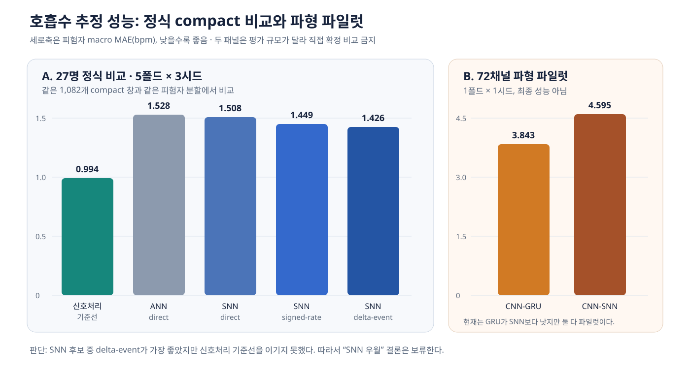
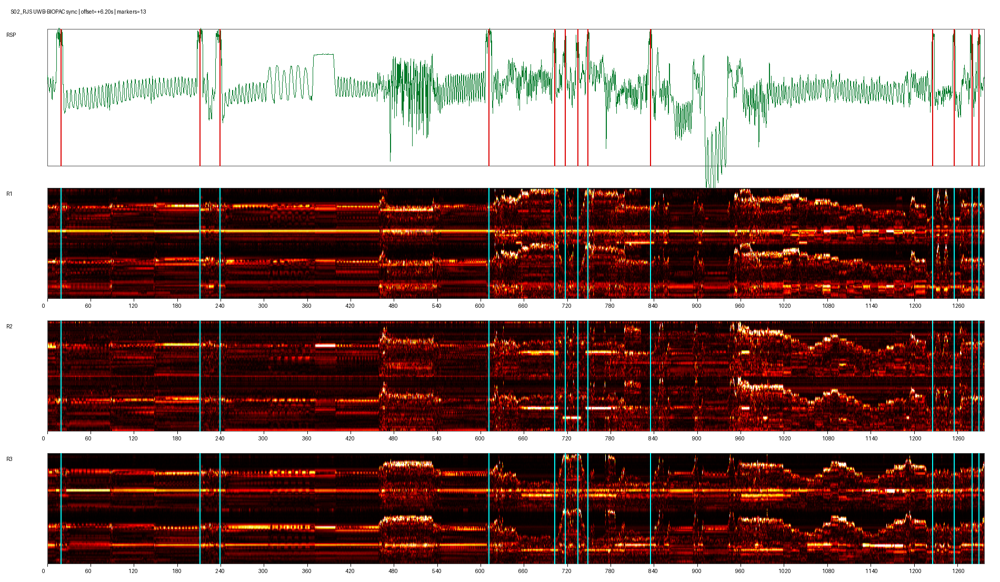
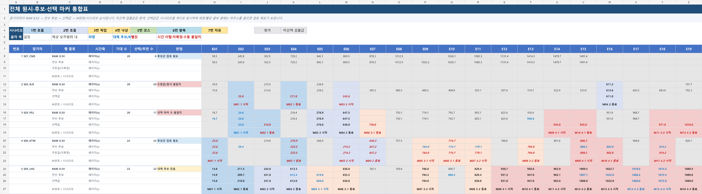
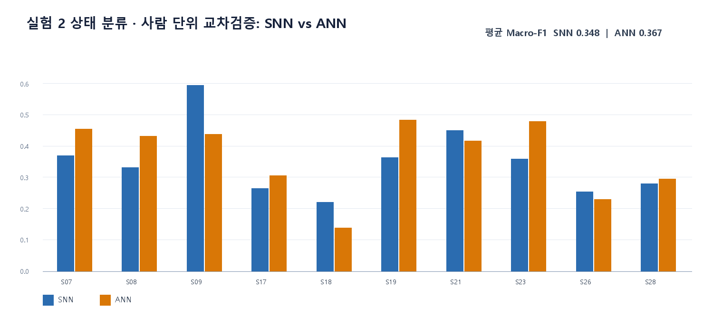
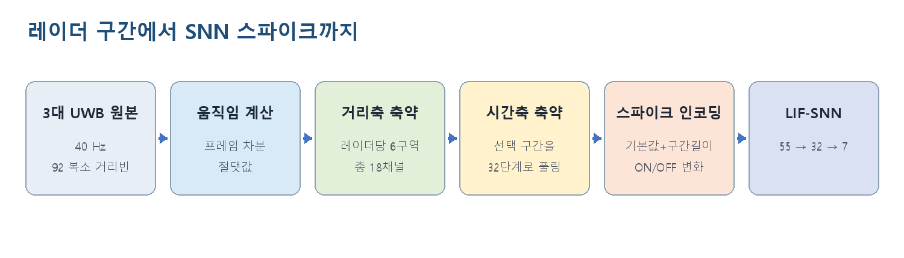
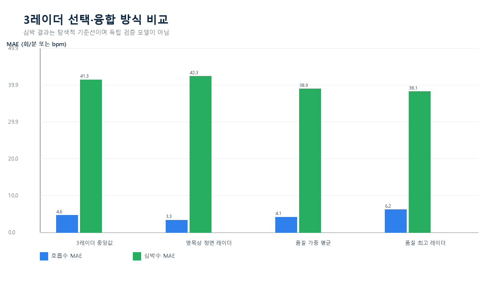
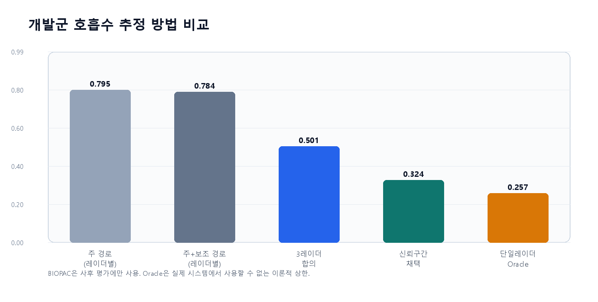
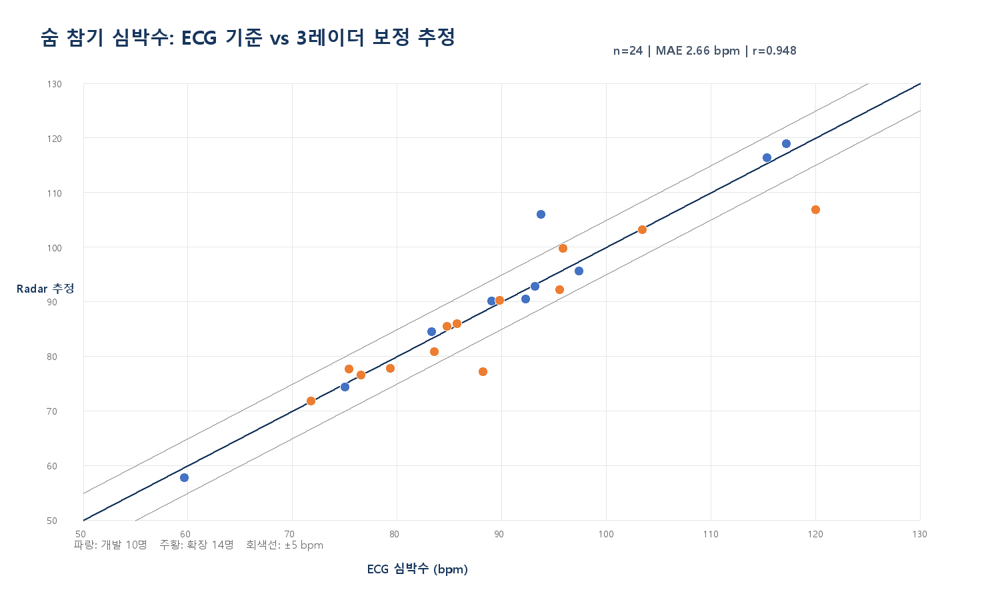

# UWB–BIOPAC 싱크·마커·호흡추정 전체 기술보고서

> 범위: 2026-08-29부터 2026-09-01까지 이 대화에서 수행한 작업
> 목적: 무엇을 왜 했고, 어떤 데이터와 설정으로 무엇을 얻었으며, 어디까지 믿을 수 있는지를 한 문서에서 확인
> 상세 근거: 각 단계의 상세작업기록, 코드, CSV, 모델은 001~023 폴더에 보존

## 1. 결론부터

1. **싱크 코드는 실제로 실행했고, MATLAB 원본 검출과 재구현 검출은 원본이 있는 29명에서 수치상 일치했다.** 다만 코드끼리 일치한다는 사실은 선택한 마커가 실험의 실제 경계라는 뜻과 다르므로 원시 후보, 프로토콜 시간, 레이더 움직임을 함께 전수검사했다.
2. **프로토콜 마커는 S01~S03 20개, S04 이후 22개로 판단했다.** 22개는 실험 4에 물건집기 한 쌍이 추가된 것으로 해석했다. BIOPAC 임계값 자동 검출 개수는 실제 마커 개수와 같지 않았다.
3. **초기 7개 시나리오 분류 SNN은 높은 점수가 나왔지만 최종 연구목표로 채택하지 않았다.** 구간 길이와 큰 움직임으로 시나리오를 맞힐 가능성이 커 “호흡을 추론했다”는 근거가 되지 않기 때문이다.
4. 실험 1의 방향은 최종 예측목표가 아니라 **어느 레이더·경로를 신뢰할지 정하는 조건**으로 바꿨다. 실험 2는 상태 이름 분류보다 일반·느린·숨참기·회복·운동 후에서 **UWB로 BIOPAC 호흡수와 파형을 얼마나 재현하는지**에 집중했다.
5. **27명 정식 피험자 단위 교차검증에서 최선 compact SNN은 subject-macro 1.426 bpm MAE였고, 같은 기준의 신호처리 0.994 bpm보다 나빴다.** 신호처리의 창 전체 평균은 0.992 bpm이다. 따라서 현재 모델이 단순 신호처리보다 우수하다고 주장할 수 없다.
6. 피드백에 맞춰 3레이더×8경로×I/Q/위상으로 **72채널 파형 데이터셋**을 만들고 CNN-GRU와 CNN-SNN을 실행했지만, 현재 결과는 1폴드×1시드 파일럿이며 최종 모델이 아니다.

## 2. 작업이 이어진 순서와 이유

|순서|한 일|왜 다음 단계로 갔는가|
|---:|---|---|
|1|원본 누락 확인|자료가 없으면 싱크 실패와 파일 누락을 구분할 수 없기 때문|
|2|UWB–BIOPAC 자동 싱크와 역순 처리|실험별 시간을 같은 기준축으로 맞추기 위해|
|3|MATLAB 독립 재검증|재구현 코드가 원시 마커를 다르게 찾는지 확인하기 위해|
|4|원시 후보 전수검사와 20/22개 선택|자동 후보 수가 실제 프로토콜 마커 수와 달랐기 때문|
|5|초기 7종 SNN|데이터 적재·학습·저장 파이프라인이 작동하는지 확인|
|6|실험 1·2 세부 라벨|7종 구분이 호흡 추론 목표와 다르다는 문제를 해결|
|7|방향·멀티패스 분석|방향마다 잘 보이는 레이더와 경로가 다름을 확인|
|8|10명 신호처리 개발|가능한 방법과 실패형태를 빠르게 탐색|
|9|27명 정식 compact 비교|새 사람에게 일반화되는지 공정하게 확인|
|10|72채널 파형 데이터와 심층 모델|요약 특징과 상태별 필터가 가진 한계를 줄이기 위해|

앞 단계 결과가 다음 질문에 충분한 답을 주지 못하면 목표를 좁히거나 입력을 더 보존했다. 점수가 높다는 이유만으로 초기 모델을 최종 모델로 승격하지 않았다.

## 3. 데이터는 무엇이고 어떻게 사용했는가

|자료|내용|사용 위치|모델 입력 여부|
|---|---|---|---|
|UWB 레이더 1·2·3 원본|40 Hz, 프레임당 185 float, 92개 복소 range bin|움직임, I/Q, 위상, 경로 품질, 모델 입력|예|
|BIOPAC RSP|호흡 파형과 8.5 V 이상 마커 후보|싱크, 경계 보조, 호흡수·파형 정답|아니오|
|BIOPAC ECG|숨참기 심박 탐색의 정답|사후 비교|아니오|
|실험 PPT·상세 안내|예정 순서와 시간, 1분 전환, 호흡 안내, 숨참기 예외|마커 번호와 라벨 해석|아니오|
|마커 검수 엑셀|원시 후보, 선택값, M01… 번호, 시나리오, 예외 메모|경계 잠금과 사람이 확인하는 근거|아니오|

**누수 방지 원칙:** BIOPAC은 시간 정렬, 정답 생성, 사후 평가에만 사용한다. 실제 환경에서는 UWB만 있으므로 저장 모델 입력에 BIOPAC 신호, 호흡수, 상태 정답이 들어가면 안 된다.

### 피험자 구성

- 정식 compact와 파형 학습에 사용 가능한 피험자: 27명
- 제외: S01_CMS는 실험 1·2 외부 경계 불명확, S22_KJH는 M01 누락, S24_KHJ는 UWB 원본 없음
- 10명 자료: 규칙과 가능성을 반복 확인한 **개발 자료**
- 27명 평가: 같은 사람의 창이 학습·검증·시험에 섞이지 않는 **피험자 단위 평가**

“27명 전체 최종 모델”은 교차검증 후 27명 모두로 다시 학습한 배포 후보다. 그 파일을 학습자료에 다시 시험한 점수는 일반화 성능이 아니며, 예상 성능은 피험자 단위 교차검증으로 판단한다.

## 4. 싱크와 마커를 어떻게 정했는가

### 자동 싱크

- BIOPAC RSP에서 8.5 V 이상 구간을 마커 후보로 검출
- 4초 이내 후보는 하나로 병합
- UWB는 각 레이더 연속 프레임의 복소 I/Q 차이로 움직임 점수를 계산
- 3레이더 움직임 점수를 평균하여 공통 움직임 축 생성
- BIOPAC 시간 = UWB 시간 + offset으로 정의
- -12~+12초를 0.1초 간격으로 탐색
- 후보 마커 근처 UWB 움직임이 최대가 되는 offset을 자동값으로 제안
- 자동값이 애매하면 그림과 예정시각을 보고 수동 조정하고 사유를 기록

위 그림은 초록 RSP, 빨간 세로선 BIOPAC 원시 마커, 아래 3개 열지도 UWB 레이더, 하늘색 선은 offset 적용 경계다. **점선을 무조건 겹치는 작업이 아니라**, 실험 동작이 나타나는 밝은 변화와 마커의 시간관계가 전체 구간에서 일관적인지 확인하는 화면이다.

### MATLAB 재검증의 의미

첨부 sync_tool_S02.m의 마커 검출 로직과 일괄 구현을 같은 원본에 실행했다. 원본이 있는 29명에서 원시 검출 수와 값이 일치했고 최대 수치 차이는 약 2.84×10⁻14초였다. 이는 **코드 재현성**을 확인한 결과다. 어떤 후보를 M01~M22로 선택할지는 별도의 프로토콜 판단이다.

### 자동 검출 수와 실제 마커 수가 달랐던 이유

RSP가 8.5 V를 넘는 모든 구간은 후보가 된다. 길게 유지된 신호, 운동·자세변화, 가까운 후보의 병합, 마커 누락 때문에 자동 후보는 20/22보다 적거나 많을 수 있었다. 조사 결과 목표보다 적은 경우 17명, 같은 경우 3명, 많은 경우 10명이었다.

선택 순서는 다음과 같다.

1. 원시 후보를 삭제하지 않고 한 셀에 한 값씩 공개
2. S01~S03은 20개, S04 이후는 22개라는 프로토콜 순서 적용
3. 시나리오 예정시간과 후보 간 간격을 대조
4. 레이더 움직임 경계와 대조
5. 하나로 확정하기 어려우면 후보군과 사유를 남김
6. 미선택 값은 회색, 시나리오별 선택값은 다른 배경색, 시간 이탈·미확정·수동 불일치는 글자색과 셀 메모로 표시

## 5. 실험 1·2 라벨은 어떻게 만들었는가

### 실험 1: 방향

레이더가 45° 간격으로 놓였다고 보고 참가자가 바라보는 레이더에 따라 각 레이더의 상대각을 정의했다.

|참가자 방향|레이더 1 상대각|레이더 2 상대각|레이더 3 상대각|
|---|---:|---:|---:|
|레이더 1 정면|0°|+45°|+90°|
|레이더 2 정면|-45°|0°|+45°|
|레이더 3 정면|-90°|-45°|0°|

각 방향은 안내상 약 1분이며 회전 시점 근처 레이더 움직임 피크로 경계를 보정했다. 처음에는 각도 분류를 시도했지만 ±90°에서 호흡 관측이 약했고 사람 독립 분류도 충분하지 않았다. 그래서 방향 라벨은 버리지 않고 **레이더 선택, 가중치, 품질분석 조건**으로 유지했다.

### 실험 2: 호흡 상태

일반 호흡, 느린 호흡, 숨참기, 재호흡·회복, 스쿼트/운동, 운동 후 상태로 나눴다. 숨참기는 안내상 30초지만 너무 힘들면 약 25초부터 쉬어도 되므로, 8명은 RSP 재호흡으로 종료를 검출했고 19명은 확정할 증거가 부족해 예정 30초를 사용했다. 운동 내부에서 마커처럼 보이는 후보가 10명 중 6명에 있어 자동 후보를 그대로 상태 경계로 쓰지 않았다.

실험 1·2에서 만든 10명 자료는 총 840개 창, 방향 341개와 상태 499개였다. 사람 단위 교차검증에서 실험 2 Macro-F1은 SNN 0.348, ANN 0.367로 낮았다.

이 실패 때문에 “호흡 상태 이름 맞히기”보다 BIOPAC 호흡수와 파형을 직접 추정하는 쪽으로 연구목표를 바꿨다.

## 6. 데이터셋 구성

### 초기 7개 시나리오 분류

- 자동점검을 통과하고 22개 선택 마커가 있던 10명
- 시나리오 구간 110개
- 입력 32시점×55특징
- 6개 거리영역의 레이더 움직임 특징과 구간 요약을 spike로 인코딩
- 목적: 데이터 적재, 학습, 저장 파이프라인 확인
- 한계: 시나리오 길이와 큰 동작이 정답 단서가 되어 호흡 추론과 다름

### 27명 compact 데이터셋

- 창 30초, 이동 5초
- UWB 40 Hz를 모델 5 Hz로 축소, 150시점
- 시계열: 3레이더 위상과 변화량 6채널
- 스칼라: 레이더별 품질, 스펙트럼, 움직임, 후보 호흡수, 레이더 간 합의도 등 27개를 매 시점에 반복
- 입력 형상: 1,082×150×33
- 유효 호흡수 정답 947창, 움직임 양성 130창, 움직임 불명 5창
- BIOPAC RSP에서 구한 호흡수를 연속값 정답으로 사용

compact 데이터는 상태별 호흡 대역을 사용했다. 실제 배포에서 상태를 미리 모르면 같은 전처리를 공정하게 적용할 수 없으므로 이 성능은 연구 중간 비교로 보며, 파형 데이터에서는 공통대역으로 바꿨다.

### 72채널 파형 데이터셋

- 27명, 총 1,564창; 파형·호흡수 정답 유효 1,325창
- 창 20초, 이동 5초, 10 Hz, 200시점
- 레이더 3대×신호품질 상위 경로 8개×백색화 I, 백색화 Q, 공통대역 위상 3종 = 72채널
- 입력 형상 1,564×72×200, 파형 정답 1,564×200
- 공통 호흡대역 0.07~0.7 Hz
- 상태명은 창을 정의할 때만 사용하고 모델 입력에는 넣지 않음
- 데이터 본체는 84,536,500바이트이며 생체신호 파생자료라 저장소에서 제외; 생성 코드, manifest, 요약, SHA-256 보존

데이터 흐름은 “3대 UWB 원본 → 레이더별 경로품질 → 레이더당 상위 8개 후보경로 → I/Q/공통대역 위상 → 72×200 입력”이다. BIOPAC RSP는 이 입력과 합쳐지지 않고 별도로 정답 파형과 호흡수를 만든다.

8개 후보는 물리적으로 확인된 LoS/고스트가 아니라 품질 순위다. 빈 환경 측정과 방 기하가 없어 “고스트를 정확히 분리했다”고 표현하면 안 된다.

## 7. 모델 구조와 학습 설정

### 초기 7종 분류 SNN

구조: 32×55 spike → LIF 32개 → 시간평균 7개 class 전류

|항목|설정|
|---|---|
|은닉층|LIF 1층, 32뉴런|
|학습|surrogate-gradient BPTT, Adam|
|최대 에폭|90|
|실제 최종 전체학습|60에폭|
|배치|16|
|학습률 / 가중감쇠|0.004 / 1e-4|
|조기종료|patience 16|

높은 분류점수 약 0.964는 최종 호흡 성능이 아니다. 이 구조가 얕은 이유는 파이프라인 검증용 파일럿이었기 때문이며, 이를 논문 수준 최종 SNN으로 간주하지 않는다.

### 27명 compact ANN/SNN

- ANN: 150×33을 4,950차원으로 펼침 → ReLU 64 → 호흡수와 움직임 2출력
- SNN: direct, signed-rate 또는 delta-event → LIF 64 → 시점별 전류의 시간평균 → 호흡수와 움직임 2출력

|모델|인코딩·층|파라미터|학습률|최종 전체학습 에폭|
|---|---|---:|---:|---:|
|ANN direct|4,950 → ReLU 64 → 2출력|316,994|1e-3|13|
|SNN direct|33 전류입력 → LIF 64 → 2출력|2,306|5e-4|59|
|SNN signed-rate|6개 동적채널을 양·음 spike로 분리 + 27 스칼라 → LIF 64|2,690|5e-4|40|
|SNN delta-event|6개 동적채널의 ±0.25 변화 이벤트 + 27 스칼라 → LIF 64|2,690|5e-4|39|

공통 출력은 표준화 호흡수 연속값과 움직임 logit이다. 손실은 호흡수 MSE/2 + 0.2×불균형보정 움직임 BCE, gradient norm은 5로 제한했다. 평가 학습은 최대 120에폭, 최소 30에폭, patience 15, 배치 16이었다.

### CNN-GRU와 CNN-SNN 파형 파일럿

공통 전단은 각 레이더 24채널에 공유되는 1D CNN이다.

Conv 24→32, kernel 7 → Conv 32→64, kernel 5, stride 2 → Conv 64→64, kernel 3 → 3레이더 softmax gate

- **CNN-GRU:** GRU 96 → 파형 decoder와 48유닛 head → 호흡수, 움직임, 무호흡; 108,949파라미터
- **CNN-SNN:** recurrent LIF 128 → recurrent LIF 64 → 파형 decoder와 64유닛 head → 호흡수, 움직임, 무호흡; 95,509파라미터
- 파형 decoder: Conv 96/64→48, kernel 5 → 24, kernel 5 → 1, kernel 7; 이후 200시점으로 보간
- 손실: 파형 + 0.50×호흡수 Smooth-L1 + 0.20×움직임 BCE + 0.20×무호흡 BCE
- 배치: 학습 32, 검증·시험 64; AdamW, weight decay 1e-4
- 학습률: GRU 8e-4, SNN 5e-4
- 파일럿: fold 1, seed 42, 최대 100에폭, 최소 25에폭, patience 15

## 8. 성능과 판단

### 방향·멀티패스 탐색

10명 개발 자료에서 3레이더 합의와 품질가중 융합을 비교했지만 심박은 약 38~42 bpm MAE로 실패했다. 호흡수도 방향별 최적 레이더가 달라 고정 평균보다 품질 기반 선택이 필요하다는 단서만 얻었다.

### 10명 개발군 호흡수

10명을 보며 규칙을 만든 개발평가에서 주 경로 0.795, 후보경로 0.784, 3레이더 합의 0.501, 신뢰구간 선택 0.324 bpm이 나왔다. 단일 레이더 Oracle 0.257은 BIOPAC 정답을 보고 가장 좋은 레이더를 고른 이론적 상한이라 실제 시스템에 쓸 수 없다. 이 결과는 독립 시험점수가 아니다.

### 27명 정식 compact 비교

|모델|피험자 macro MAE|±2 bpm 비율|움직임 균형정확도|
|---|---:|---:|---:|
|신호처리 기준선|0.994 bpm|0.905|—|
|ANN direct|1.528 bpm|0.788|0.961|
|SNN direct|1.508 bpm|0.799|0.957|
|SNN signed-rate|1.449 bpm|0.812|0.958|
|SNN delta-event|1.426 bpm|0.814|0.959|

delta-event가 학습모델 중 가장 낫지만 같은 집계의 기준선보다 0.432 bpm 나쁘다. 신호처리의 947개 창 전체 평균은 0.992 bpm이다. 정식 비교 전체 시간은 약 858초, 14.3분이었다. 원시 전체 녹화를 매번 읽은 것이 아니라 1,082개 compact 창을 학습했기 때문에 몇 시간 걸리지 않았다.

### 파형 파일럿

|모델|최적/실행 에폭|시간|피험자 macro 호흡수 MAE|파형 절대상관|
|---|---:|---:|---:|---:|
|CNN-GRU|20 / 35|112초|3.843 bpm|0.337|
|CNN-SNN|10 / 25|160초|4.595 bpm|0.268|

현재는 GRU가 SNN보다 낫지만 1폴드·1시드뿐이다. 이 수치만으로 최종 우열을 결정하지 않는다.

### 숨참기 심박 탐색

24명에서 숨참기 ECG와 레이더 심박 후보를 비교했다. 무보정 중앙 절대오차 10.76 bpm, 고조파 보정 후 2.66 bpm이었지만 보정 규칙이 정답에 의존할 가능성이 커 탐색 결과로만 남겼다. 현재 주 연구성과로 쓰지 않는다.

## 9. 무엇을 왜 바꿨는가

|이전 선택|문제|바꾼 선택|판단 근거|
|---|---|---|---|
|7개 시나리오 분류|길이·큰 동작으로 맞힐 수 있음|호흡수·파형 추정|BIOPAC과 직접 비교 가능한 연속 정답 필요|
|방향 각도 예측|±90° 호흡관측과 사람 독립 분류가 약함|방향을 레이더/경로 선택 조건으로 사용|각도마다 잘 보이는 레이더가 다름|
|10명 개발결과 강조|규칙을 만들며 반복 관찰|27명 피험자 단위 교차검증|새 사람 일반화 확인 필요|
|상태별 호흡필터|배포 시 상태를 미리 모르면 누수·불공정|공통 0.07~0.7 Hz|실제 입력만으로 처리 가능해야 함|
|요약 특징만 학습|신호처리보다 성능이 낮음|72채널 I/Q·위상 파형 보존|다중경로·위상 정보를 모델이 직접 활용하도록 함|
|SNN만 주장|구조 효과와 인코딩 효과 분리 불가|ANN·GRU와 같은 분할에서 비교|모델 종류 자체의 이점 검증 필요|

## 10. 저장 모델은 독립적으로 쓸 수 있는가

- NPZ compact 모델은 저장 후 다시 불러와 1,082창을 추론했고 유한한 예측 1,082개를 확인했다. 품질거부는 133창이었다.
- PT 파형 파일럿 두 개도 로드 가능함을 확인했다.
- 따라서 **전처리된 입력 배열이 있으면 모델만으로 추론 가능**하다.
- 그러나 현재 raw DAT 폴더 하나를 넣어 자동으로 싱크, 경계, 창 생성, 추론까지 하는 완전한 사용자용 패키지는 아니다.
- compact 모델은 상태별 필터 문제도 있어 그대로 현장 배포하면 안 된다.

## 11. 완료·보류·다음 단계

### 완료

- 원본 누락점검, 역순 싱크, MATLAB 원시마커 재검증
- 마커 원시값, 선택값, 번호, 색, 메모가 있는 전수검사 엑셀
- 10명 실험 1·2 라벨과 ANN/SNN 사람 단위 탐색
- 27명 compact 데이터셋, 5폴드×3시드 ANN/SNN 정식 비교
- 72채널 파형 데이터셋 생성과 CNN-GRU/CNN-SNN 파일럿
- 모델 로드와 전처리 배열 추론 재현 확인

### 보류 또는 실패로 기록

- 시나리오 분류 점수를 호흡 추론 성능으로 주장
- 방향 자체를 최종 분류목표로 사용
- 숨참기 심박을 주 성과로 사용
- SNN이 신호처리보다 우수하다는 주장
- 물리적 LoS/고스트 분리 완료 주장

### 다음 순서

1. 72채널 파형 입력의 품질게이트와 공통 전처리를 고정
2. CNN-GRU와 CNN-SNN을 동일한 5폴드×3시드로 정식 비교
3. direct, signed-rate, delta-event 외에 latency 또는 time-to-first-spike 인코딩 후보를 같은 분할에서 비교
4. 신호처리 기준선은 subject-macro 0.994 bpm과 창 전체 평균 0.992 bpm을 구분해 함께 제시
5. 잘되는 사람과 안되는 사람을 방향, 움직임, RSP 품질, 경로 일관성으로 나눠 실패원인을 분석
6. raw UWB → 전처리 → 품질거부 → 모델 추론을 하나의 독립 실행 명령으로 패키징

정식 파형 비교 전 통과 조건은 “새 사람 분할 고정, BIOPAC 입력 금지, 상태별 필터 금지, 같은 창·같은 시드·같은 평가표”다. 이 조건을 바꾸면 이전 수치와 공정하게 비교할 수 없다.

## 12. 기록 위치

- 시간순 전체 색인: [README.md](README.md)
- 누락·제외·대체자료: [누락_제외_대체목록.md](누락_제외_대체목록.md)
- 파일 해시: [파일무결성_SHA256.txt](파일무결성_SHA256.txt)
- 현재 결론: [023 상세작업기록](023_현재결론과_다음단계/상세작업기록.md)

이 보고서는 각 단계의 실제 코드, CSV, 모델과 연결되는 안내문이다. 발표용 결론과 탐색 결과를 섞지 않기 위해 모든 수치 옆에 개발, 정식, 파일럿 여부를 표시했다.
