# 3-Radar SNN 프로젝트 작업 분해·기술 선택·검증 청사진

- 기준일: 2026-08-30, Asia/Seoul
- 목적: 해야 할 일을 사람이 이해하기 쉬운 작업 단위로 나누고, 각 파트의 후보 기술과 프로젝트 적합성을 한 문서에서 결정
- 대상: 3대 XeThru UWB radar의 32초 causal window로 respiratory rate(RR)를 추정하는 시스템
- 성능 목표: 내부 6개 정확도 gate 동시 통과 후 독립 prospective 검증
- 현재 주장 수준: retrospective research candidate, 상용·의료 성능 미입증

> 이 문서는 기술을 많이 나열하는 목록이 아니다. 각 파트에서 **무엇을 채택하고, 무엇을 보조 실험으로 두며, 무엇을 사용하지 않을지**를 현재 데이터와 실패 원인에 맞춰 결정한 실행 청사진이다.

관련 상세 근거는 [SNN 학습 방법론과 최종 권고안](SNN_TRAINING_METHODOLOGY_RECOMMENDATION_2026-08-30.md), 현재 수치는 [REPORT](../REPORT.md), 상용 gate는 [COMMERCIAL_SNN_GOAL_V2](COMMERCIAL_SNN_GOAL_V2.md)에 있다.

---

## 0. 한 장 요약

### 0.1 현재 위치

| 질문 | 현재 답 |
|---|---|
| 데이터 구조를 파악했는가? | raw record, timestamp, BIOPAC marker, 7-stage protocol, range tracking까지 파악 |
| 현재 가장 좋은 모델은? | validation-locked structured 12-step SNN 두 모델 ensemble |
| 현재 성능은? | MAE 1.291, identity-macro 1.220, 25–35 bpm MAE 4.216 |
| 상용 정확도 gate는? | 0/6 통과 |
| 주된 모델 병목은? | 좋은 candidate 부재보다 unseen identity에서 ×1/×2/×3/×4 harmonic 선택 실패 |
| 새 corrected acquisition 성능은? | 아직 없음. full-cohort strict cache/OOF 미완료 |
| 최신 source-consistent sync 상태는? | S02/S03/S30 smoke에서 승인 0/3, scientific-eligible 0/3 |
| 가장 적합한 SNN 학습법은? | surrogate-gradient 직접학습 + PLIF/ALIF + KD + TET |
| 가장 적합한 전체 구조는? | analog radar front-end + coordinate-aware harmonic graph + short-step hybrid SNN |
| range tracker가 현재 leader에 들어가는가? | 아니오. extractor와 `range_aux`는 있으나 model 입력에는 미연결 |

### 0.2 상태 범례

| 표시 | 의미 |
|:---:|---|
| ✅ | 구현되고 해당 범위에서 검증됨 |
| 🟡 | 구현됐지만 연결·full evaluation·승인이 미완료 |
| 🔵 | 근거가 있어 채택을 권고하지만 아직 통합·측정되지 않음 |
| ⚪ | 비교 기준 또는 제한된 보조 실험 |
| ❌ | 현재 프로젝트의 주 경로에서 사용하지 않음 |
| 🛑 | 이것이 해결되지 않으면 다음 과학 단계로 진행할 수 없는 gate |

### 0.3 최종 기술 선택 한 줄

```text
정확한 measured-time 데이터 계약
→ causal radar 전처리 + raw/SVD/range evidence
→ 좌표를 보존하는 analog encoder
→ harmonic candidate graph
→ 8–12 step PLIF/ALIF SNN
→ soft-risk 학습 / hard-safe 배포
→ identity-disjoint nested OOF
→ prospective 검증
```

### 0.4 전체 의사결정

| 영역 | 채택 | 보조/비교 | 제외 또는 보류 |
|---|---|---|---|
| 시간축 | measured radar timestamp + content-bound marker sync | nominal 40 Hz는 legacy 비교 | 승인 없는 강제 BIOPAC 정렬 |
| denoising | causal robust processing + FFT + SVD evidence | 작은 neural denoiser ablation | 미래를 보는 radar zero-phase filter |
| radar layout | raw-power 기본 | split-halves I/Q ablation | 미확정 I/Q를 사실로 가정 |
| 사람 위치 | causal active range-bin tracker | learned range attention | 사람 ID·미터 좌표 주장 |
| 기본 모델 | hybrid analog+SNN | ANN teacher | full-map Poisson SNN |
| SNN 학습 | direct surrogate BPTT + PLIF/ALIF | SLAYER/e-prop 비교 | STDP-only 최종 회귀 |
| 보조 학습 | teacher KD + split-safe SSL + TET | ANN→SNN port 비교 | test identity를 쓴 SSL |
| RR 출력 | distribution + expected RR | scalar Huber 보조 | scalar 하나만 출력 |
| harmonic 처리 | coordinate-aware directed graph + dual path | small attention ablation | 좌표 더하기 후 평균 pooling |
| router | soft expected-risk 학습, hard inference | hysteresis/track | hard argmax error만으로 학습 |
| 검증 | physical-identity 6-fold nested OOF | non-overlap·8 phases | random window split |
| 배포 | safe anchor/no-estimate + 7 masks | selective output | 불확실한 값 강제 출력 |

---

## 1. 전체 시스템을 한눈에 보기

### 1.1 데이터에서 제품 출력까지

```mermaid
flowchart LR
    A[3대 UWB radar<br/>740-byte records] --> B[정확한 parser<br/>3 header + 182 float]
    B --> C[Measured timestamp<br/>plateau/drift 처리]

    R[BIOPAC RSP 250 Hz<br/>reference only] --> S[Marker/reference QC]
    C --> G{Sync authority}
    S --> G

    G -- 미승인 --> X[Diagnostic only<br/>학습·성능 주장 금지]
    G -- 승인 --> D[Strict acquisition cache]

    D --> F1[Range-frequency map]
    D --> F2[Label-free SVD evidence]
    D --> F3[Causal range-track aux]

    F1 --> E[Shared analog encoder]
    F2 --> E
    F3 --> E

    E --> H[Direct RR posterior<br/>+ candidate bank]
    H --> I[Coordinate-aware<br/>directed harmonic graph]
    I --> J[8–12 step<br/>PLIF/ALIF SNN]
    J --> K[Direct head + factor/router<br/>+ expert risk + quality]

    K --> Q{Safety gate}
    Q -- 통과 --> Y[RR + uncertainty]
    Q -- 실패 --> Z[Safe anchor 또는 no-estimate]

    Y --> V[Identity-disjoint OOF<br/>prospective validation]
    Z --> V

    classDef radar fill:#dbeafe,stroke:#2563eb,color:#111827;
    classDef reference fill:#f3e8ff,stroke:#9333ea,color:#111827;
    classDef gate fill:#fef3c7,stroke:#d97706,color:#111827;
    classDef model fill:#dcfce7,stroke:#16a34a,color:#111827;
    classDef blocked fill:#fee2e2,stroke:#dc2626,color:#111827;
    class A,B,C,D,F1,F2,F3 radar;
    class R,S reference;
    class G,Q gate;
    class E,H,I,J,K,Y,Z,V model;
    class X blocked;
```

### 1.2 현재 구현 상태를 겹쳐 보면

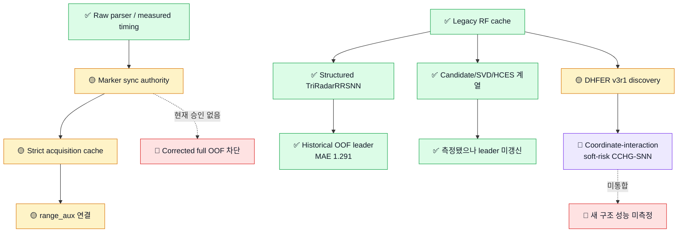

두 흐름을 혼동하면 안 된다.

- 왼쪽 legacy 흐름은 현재 수치 1.291 bpm의 근거다.
- 새 acquisition 흐름은 timing·sync·stage·range 계약을 교정하는 경로지만 아직 full strict 학습을 열지 못했다.
- CCHG-SNN은 현 실패 원인에 맞춘 권고 구조이며 현재 leader의 다른 이름이 아니다.

---

## 2. 프로젝트를 열한 개 작업 파트로 나누기

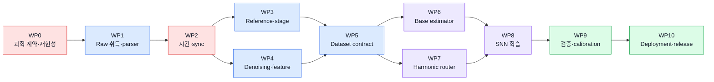

| WP | 파트 | 핵심 산출물 | 현재 상태 | 최우선 결정 |
|:---:|---|---|:---:|---|
| 0 | 과학 계약·재현성 | source/cache/split/실행 권위 hash chain | 🛑 | full-suite·real-bwrap·CONTEXT1 closure |
| 1 | Raw 취득·parser | 정확한 182-float radar stream | ✅ | corrected parser 고정 |
| 2 | 시간축·동기화 | 승인된 radar↔BIOPAC mapping | 🛑 | marker 수동 승인 또는 강한 근거 확보 |
| 3 | Reference·실험 stage | RR target/QC와 stage core window | 🟡 | batch label과 실제 phase 분리 |
| 4 | Denoising·표현 | causal RF/SVD/range feature | 🟡 | raw 기본 + SVD/range 보조 |
| 5 | Dataset contract | strict cache, hash, split authority | 🟡 | train entrypoint strict 강제 |
| 6 | Base estimator | 안정적인 direct RR posterior | ✅ | 현재 leader를 anchor/teacher로 유지 |
| 7 | Harmonic router | unseen identity의 safe factor 선택 | 🔵 | coordinate interaction + soft risk |
| 8 | SNN 학습 | 저-step 일반화 모델 | 🔵 | SG+PLIF/ALIF+KD+TET |
| 9 | 검증·calibration | leakage-free 성능·불확실도 | 🟡 | frozen identity mapping과 nested lock |
| 10 | 배포·release | streaming/fault/latency/energy 증거 | 🟡 | no-estimate와 prospective gate |

### 2.1 WP0 — 과학 계약과 재현성

이 파트는 정확도를 올리는 모델 기술이 아니라, 어떤 실행과 결과를 과학적 증거로 인정할지를 정한다. 같은 경로의 cache가 바뀌거나 outer-test가 조기에 열리면 높은 점수도 신뢰할 수 없다.

| 기술 | 프로젝트 적합성 | 결정 |
|---|---|---|
| 파일 경로·이름만 믿는 실행 | 같은 경로 내용 변경과 stale artifact를 탐지하지 못함 | ❌ 배제 |
| Source/config/data/split/checkpoint SHA chain | 결과 계보와 복구 가능성을 보존 | **핵심 채택** |
| Create-once, read-only authorization receipt | sealed target 접근 전 독립 검증 강제 | **핵심 채택** |
| Outer row를 제거한 sealed pack | accidental target access 차단 | **핵심 채택** |
| Bubblewrap target sandbox | filesystem/network capability를 제한 | **핵심 채택, 최신 재검증 필요** |
| 실패 run·GPU ledger 보존 | 선택편향과 중단 실행을 감사 | **핵심 채택** |
| Receipt를 수작업 생성하거나 guard 우회 | 증거 생성자와 승인자를 동일하게 만듦 | ❌ 금지 |

현재 권위 상태:

- 역사적 fixed evidence는 694 collected, 690 passed, 4 skipped였다.
- backup-time 연속 두 full-suite run은 `688 passed, 4 skipped, 2 failed`였다.
- 두 failure는 단독 실행 시 통과하는 order/precision-sensitive float equivalence 문제이므로 tolerance를 임의 완화해 숨기지 않는다.
- skip 4개는 최신 source에서 아직 재실행하지 못한 real-bubblewrap test다.
- CONTEXT1의 test receipt, source snapshot, pretrain authorization 세 artifact는 부재한다.
- 따라서 frozen DHFER/V8R4 production continuation은 현재 승인되지 않았다.

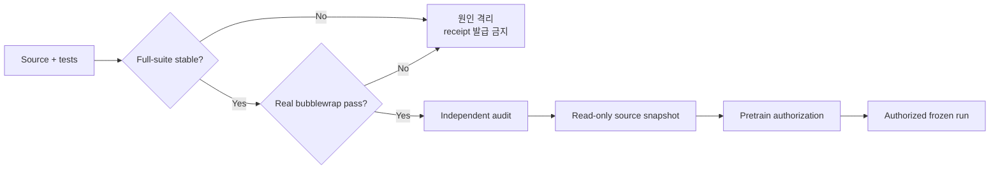

두 종류의 gate는 서로 다르다.

- **Corrected-data gate:** sync/scientific eligibility가 있어야 새 acquisition-aware 학습 가능
- **Frozen V8R4 execution gate:** stable full suite, real-bwrap, CONTEXT1 trio가 있어야 해당 campaign 재개 가능

새 versioned 모델의 unit/synthetic test까지 V8R4 receipt가 막는 것은 아니다. 반대로 unit test가 통과했다고 corrected scientific training이나 frozen production run이 자동 승인되는 것도 아니다.

WP0 완료 조건:

1. 두 full-suite failure의 원인 격리와 연속 clean run
2. 최신 source에서 real-bubblewrap 4개 검증
3. 독립 read-only audit
4. validator/runtime이 CONTEXT1 trio를 정식 발급
5. 새 output root와 immutable provenance 사용

### 2.2 서로 다른 세 차단 상태

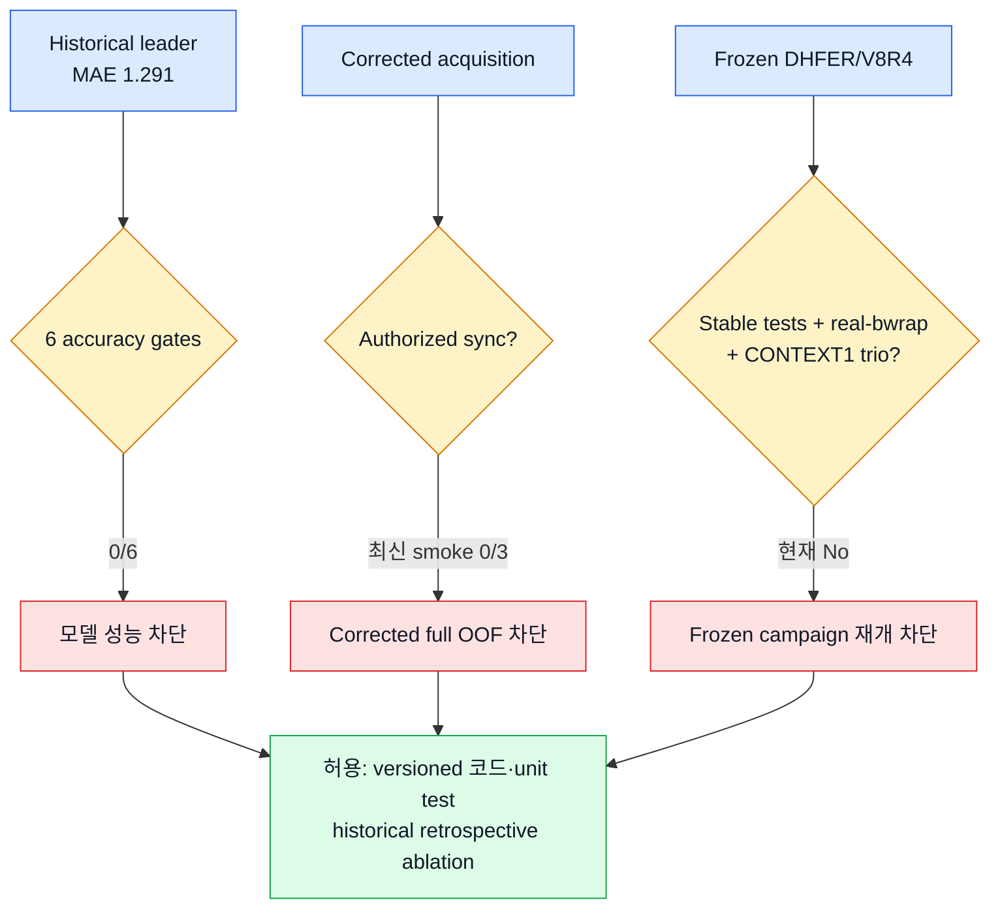

세 차단은 원인과 해법이 다르다. 정확도 실패를 sync 승인으로 해결할 수 없고, sync 승인이 생겨도 V8R4 receipt가 자동 발급되는 것은 아니다.

---

## 3. WP1 — Raw 데이터 취득과 parser

### 3.1 이 파트의 목표

모델 구조보다 먼저 “한 frame이 정확히 무엇인가”를 고정한다. parser가 틀리면 모든 spectrum, SVD, SNN 실험이 잘못된 입력에서 시작한다.

### 3.2 확인된 raw 구조

```text
한 radar record = 740 bytes
                 = uint32 header 3개, 12 bytes
                 + float32 payload 182개, 728 bytes
```

### 3.3 기술 비교

| 기술 | 장점 | 위험 | 적합성 | 결정 |
|---|---|---|:---:|---|
| Header를 byte 단위로 분리 후 182 float read | 형식이 명시적이고 검증 가능 | 장비 layout 문서가 별도 필요 | 🟢 | **채택** |
| MATLAB `FL=185`를 float로 읽고 1개만 제거 | 기존 도구와 겉보기 호환 | uint32 header 2개가 float 신호에 섞임 | 🔴 | **폐기** |
| Record 전체를 자동 dtype 추론 | 구현이 짧음 | silent misparse 위험 | 🔴 | 사용 안 함 |
| CRC/sequence/schema 검증 | corruption 조기 탐지 | 초기 구현 비용 | 🟢 | 채택 |

### 3.4 프로젝트에 맞는 선택

**명시적 binary schema parser + frame sequence/header 감사**가 유일한 주 경로다.

근거:

- record 길이가 고정돼 있다.
- 과거 MATLAB parser의 header 혼입이 실제로 확인됐다.
- radar amplitude와 spectrum은 작은 parser 오류에도 크게 왜곡될 수 있다.
- strict provenance를 위해 parser version과 source hash가 필요하다.

### 3.5 완료 조건

- 모든 chunk의 record-size remainder가 0
- payload가 정확히 182 float
- sequence gap/reset과 timestamp source 기록
- NaN/Inf/amplitude audit
- parser source SHA와 session content hash 저장

---

## 4. WP2 — 시간축과 radar–BIOPAC 동기화

### 4.1 왜 이 파트가 가장 먼저 막혀 있는가

radar feature와 BIOPAC target이 몇백 ms만 틀어져도 motion transition과 빠른 호흡에서 잘못된 label을 붙일 수 있다. 좋은 모델이 동기화 오차를 학습해 보상하도록 두면 identity/session-specific shortcut이 생긴다.

### 4.2 시간축 기술 비교

| 방법 | 장점 | 단점 | 현재 데이터 적합성 | 역할 |
|---|---|---|:---:|---|
| Nominal 40 Hz frame index | 단순, legacy 재현 가능 | 실제 drift/jitter 무시 | 🟡 | 역사적 비교만 |
| Metadata v13 measured ms | frame별 실제 시간 사용 | plateau/reset 복원 필요 | 🟢 | **radar 시간축 채택** |
| 파일명 second-resolution absolute epoch | 자동 처리 쉬움 | sub-second 정확도 부족 | 🟡 | 초기 offset 후보 |
| Marker-affine sync | offset+drift를 직접 추정 | marker pair 품질과 수동 검토 필요 | 🟢 | **현재 dataset 채택** |
| Radar–RSP 전구간 correlation | marker 없이 가능 | 호흡 자체를 사용하면 target leakage/alias 위험 | 🔴 | 자동 authority로 금지 |
| Hardware common trigger | 가장 강한 정답 | 기존 데이터에 없음 | 🟢 | **신규 수집 표준** |

### 4.3 현재 채택안

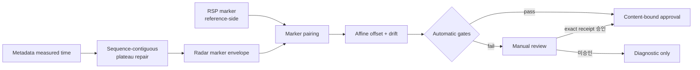

자동 gate:

- marker pair 3개 이상
- confidence ≥0.80
- RMSE ≤0.30초
- 최대 residual ≤0.75초
- drift ≤1000 ppm
- timestamp correction >50 ms이면 강제 manual review

### 4.4 현재 상태

- S03, S28, S30에서 duplicate timestamp plateau 확인
- S30 최대 correction 약 203.7 ms로 manual review 대상
- 최신 source-consistent S02/S03/S30 smoke: 승인 0/3
- 과거 29-session diagnostic: 0/29였지만 최신 code 완결 증거가 아님
- full strict acquisition cache 없음

### 4.5 완료 조건

- 29 usable session을 최신 source로 재구축
- 각 session의 auto/manual authorization receipt
- 승인 mapping과 raw content의 exact hash binding
- 승인되지 않은 session은 diagnostic cache로만 분리
- training이 승인 여부를 fail-closed로 검사

---

## 5. WP3 — BIOPAC reference와 실험 stage 복원

### 5.1 RR reference 기술 비교

| 방법 | 장점 | 한계 | 적합성 | 결정 |
|---|---|---|:---:|---|
| FFT peak 하나 | 빠르고 단순 | harmonic·nonstationary·clip에 취약 | 🟡 | 단독 사용 안 함 |
| Peak interval/IBI | 호흡 event 해석 가능 | noisy peak와 cycle 부족에 취약 | 🟡 | 보조 estimator |
| Hilbert phase slope | 연속 phase 추정 | waveform 품질에 민감 | 🟡 | 보조 estimator |
| FFT+IBI+phase 합의 | 서로 다른 실패를 교차검사 | valid coverage 감소 | 🟢 | **현재 채택** |
| Capnography/독립 adjudication | 더 강한 reference | 현재 데이터에 없음 | 🟢 | prospective 표준 |

현재 target은 BIOPAC RSP에 reference-only 0.10–0.75 Hz zero-phase filter를 적용하고, FFT peak·IBI median·Hilbert phase slope의 합의와 clipping/periodicity/concentration QC를 거쳐 만든다.

중요한 경계:

- BIOPAC zero-phase 처리는 label 경로에서만 허용된다.
- BIOPAC waveform, reference quality, sync residual은 inference feature가 아니다.
- `radar_observable`은 독립 sensor-health label이 아니라 reference와 classical radar estimate의 일치 proxy다.

### 5.2 실험 stage 기술 비교

| 방법 | 설명 | 위험 | 결정 |
|---|---|---|---|
| Session suffix를 전체 window에 broadcast | Dodge/Strike/Kick를 session label로 사용 | 실제 일곱 phase와 불일치, identity/session confounding | **폐기** |
| 고정 duration만 누적 | 구현 단순 | 문서 불일치와 수행 지연 반영 못 함 | 보조 prior |
| Spreadsheet/manual interval만 사용 | 특정 session은 정확 | 전 session 완전성 부족 | anchor |
| Ordered DP + duration/gap prior + anchor | 순서와 불확실성을 함께 표현 | 검토가 필요 | **채택** |

### 5.3 실제 일곱 phase

```text
1. 착석 호흡·세 방향 자세
2. 정상/느린 호흡·breath hold·운동 후 회복
3. 두 pickup course
4. fall scenario/course
5. 16-cell timed course
6. continuous round trip
7. 배정 자유 동작: Dodge / Strike / Kick
```

기존 Dodge/Strike/Kick별 성능표는 phase 7 행동별 성능이 아니라 legacy batch 분석이다. corrected 분석에서는 다음을 분리한다.

- `acquisition_batch`: legacy session grouping
- `acquisition_phase`: 실제 복원 stage
- `phase_status/confidence`
- `eligible_for_stage_metrics`: 안정된 core window만 true

### 5.4 완료 조건

- 모든 stage source와 ambiguity 기록
- transition/review/unassigned window는 stage metric에서 제외
- phase label은 model input에서 차단
- prospective 수집에서는 hardware event marker와 protocol logger 사용

---

## 6. WP4 — Radar denoising과 신호 표현

### 6.1 현재 causal denoising 흐름

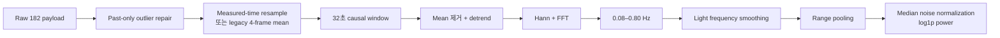

### 6.2 후보 기술 비교

| 기술 | 해결하는 문제 | 장점 | 위험 | 적합성/결정 |
|---|---|---|---|---|
| Robust causal preprocessing | impulse, trend, gain | 안정적·설명 가능 | 복잡한 motion 분리 한계 | 🟢 **기본** |
| Range-frequency map | RR 주파수와 거리 위치 | 현재 leader에 검증됨 | 32초 내 비정상성 압축 | 🟢 **기본 표현** |
| Randomized SVD views | motion/respiration component 분리 | label-free 보조 증거 | component 의미가 고정되지 않음 | 🟢 **보조 채택** |
| Causal range tracker | active bin, missing, multimodal | 사람 근처 range evidence | 사람 ID/미터 좌표 아님 | 🟢 **보조 채택, 미연결** |
| Neural denoising autoencoder | 복잡한 noise 학습 | 잠재 성능 | 18명에서 과적합·신호 삭제 위험 | 🟡 SSL 이후 ablation |
| Zero-phase radar filter | offline 신호가 매끈함 | phase distortion 없음 | 미래 leakage | 🔴 inference 금지 |
| Top-1 spectrum만 유지 | 입력 축소 | 계산 저렴 | harmonic 정보 삭제 | 🔴 주 경로 금지 |

### 6.3 I/Q layout 결정

현재 target-free evidence는 split-halves `[I0…I90,Q0…Q90]` 가설을 지지하지만 장비 명세로 확정되지 않았다.

| 선택 | 결정 |
|---|---|
| Raw-power branch | 항상 사용 |
| Split-halves phase branch | hardware/layout contract가 고정된 ablation에서만 |
| Interleaved branch | 근거 약함, 비교 진단만 |
| Test session 전체를 보고 layout 선택 | transductive preprocessing이므로 금지 |

### 6.4 권고 feature stack

```text
필수   : raw-power range–frequency map + radar availability
보조 1 : label-free SVD candidate evidence
보조 2 : causal range-bin/confidence/missing/multimodal
선택   : frozen split-I/Q phase branch
금지   : BIOPAC, identity, stage, oracle candidate, future state
```

### 6.5 완료 조건

- `range_aux`를 cache loader/dataset/model에 명시적으로 연결
- raw/SVD/range 각각 mask와 provenance 보존
- unavailable은 scaler 전후 exact zero
- feature extraction에 target/reference 접근이 없음을 test
- latency와 online/offline parity 측정

---

## 7. WP5 — Dataset contract, split, provenance

### 7.1 가장 중요한 누수 방화벽

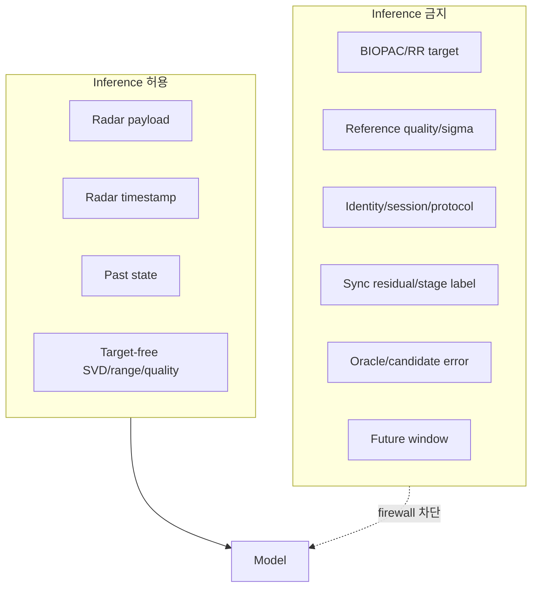

### 7.2 split 기술 비교

| split | 겉보기 장점 | 실제 문제 | 결정 |
|---|---|---|---|
| Random window split | 데이터가 많고 score가 안정적 | 87.5% overlap과 동일 사람 누수 | **금지** |
| Session split | 같은 session overlap 방지 | 같은 physical identity가 다른 session에 존재 | 불충분 |
| Physical-identity GroupKFold | unseen person 일반화 평가 | 18명이라 CI가 넓음 | **채택** |
| Nested identity split | threshold/model selection까지 분리 | 계산 비용 | **상용 연구 채택** |
| Prospective cohort | 최종 일반화 확인 | 새 데이터 필요 | **release 필수** |

### 7.3 현재 고정 구조

- physical identity 18명
- 6 folds
- outer-test identity 3명
- validation identity 3명: `(outer+1) mod 6`
- train identity 12명
- scaler/teacher/router/threshold/calibration은 train 또는 validation만 사용

corrected cache에서 valid row 수가 달라져도 기존 identity→fold mapping을 재사용한다. GroupKFold를 다시 실행하면 데이터 교정 효과와 split 난이도 변화가 섞인다.

### 7.4 구현 상태와 gap

| 항목 | 상태 |
|---|---|
| Acquisition manifest 검증 | ✅ opt-in 구현 |
| Scientific eligibility 검증 | ✅ opt-in 구현 |
| 기본 `train.py`가 strict mode 강제 | 🟡 미연결 |
| `range_aux` model input | 🟡 미연결 |
| SVD acquisition provenance | ✅ 구현 |
| 모든 cache file/model source SHA binding | 🟡 일반 run은 보강 필요 |
| Reconstruction pipeline hash에 `radar_timing.py`, `data.py` 포함 | 🟡 보강 필요 |

### 7.5 완료 조건

- strict flag 없는 corrected training 자체를 거부
- legacy와 acquisition-aware session 혼합 거부
- cache manifest·feature files·source·config·split·checkpoint SHA closure
- annotation-only column allowlist test
- resume RNG/sampler/session-state 복원 검증

---

## 8. WP6 — 안정적인 base RR estimator

### 8.1 현재 leader 구조

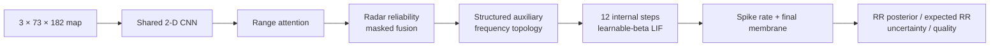

현재 12 step은 radar의 실제 12개 time sample이 아니라 같은 static feature current를 반복 전개하는 SNN 내부 계산축이다. cross-window membrane state는 없고, radar-only causal history feature가 과거 정보를 전달한다.

### 8.2 base estimator 후보 비교

| 구조 | 정확도/안정성 | 데이터 적합성 | 효율 | 결정 |
|---|---|---|---|---|
| Classical spectral | 낮음, MAE 4.342 | 해석 가능 | 높음 | 안전 anchor/feature만 |
| ExtraTrees | MAE 1.557 | 작은 데이터에 강함 | 보통 | non-neural baseline |
| ANN teacher | MAE 1.482 | 안정적 soft target | 보통 | teacher |
| Flat/default SNN | MAE 1.407 | topology 손실 | 잠재 효율 | 과거 baseline |
| Structured SNN | MAE 1.333 | 주파수 구조 보존 | 좋음 | 주 component |
| Structured+exact ensemble | MAE 1.291 | 현재 최고 | 모델 2개 비용 | **현재 leader** |

### 8.3 프로젝트에 맞는 선택

현재 structured SNN을 버리지 않고 다음 세 역할로 유지한다.

1. corrected pipeline의 재현 baseline
2. candidate bank를 만드는 direct posterior
3. 새 router가 불안할 때 돌아가는 safe anchor/teacher

이유:

- 전체 RR에서 지금까지 가장 안정적이다.
- high-RR tail은 약하지만 normal RR fallback으로 가치가 있다.
- 새 router가 유해 correction을 할 때 base보다 나빠지지 않는 safety comparison이 가능하다.

### 8.4 완료 조건

- strict corrected cache에서 동일 split로 재학습
- 단일 model과 ensemble 비용 비교
- T=8/T=12 accuracy-latency curve
- 7 radar mask와 real corruption 평가

---

## 9. WP7 — Harmonic candidate와 safe router

### 9.1 현재 병목을 시각화

```text
좋은 candidate가 bank 안에 있는가?      대체로 YES
                  │
                  ▼
unseen identity에서 올바른 것을 고르는가?  아직 NO
                  │
                  ├─ direct/alias 구분은 비교적 가능
                  └─ ×3인지 ×4인지가 identity-dependent하고 희소
```

| 근거 | 값/관찰 |
|---|---|
| Current leader 25–35 bpm MAE | 4.216 bpm |
| 25–35 valid windows | 164 |
| 25–35 non-overlap windows | 42 |
| Candidate oracle | 설정별 약 0.43–0.56 bpm |
| 해석 | candidate representation 상한은 있으나 router가 일반화하지 못함 |

### 9.2 router 기술 비교

| 기술 | 장점 | 핵심 문제 | 적합성 | 결정 |
|---|---|---|:---:|---|
| Direct scalar correction | 단순 | ×3/×4 중간값이 catastrophic | 🔴 | 금지 |
| Binary alias gate | direct/alias 검출 강함 | correction magnitude 해결 못 함 | 🟡 | feature로만 |
| Candidate listwise posterior | 여러 후보를 직접 비교 | 좌표 표현이 중요 | 🟢 | 채택 |
| Undirected harmonic graph | 관계 표현 | 방향 의미 손실 | 🟡 | 비교 |
| Directed ×2/×3/×4 graph | subharmonic 방향 표현 | data support 필요 | 🟢 | 채택 |
| Add coordinate then mean pool | 구현 쉬움 | evidence-coordinate 결합 소실 | 🔴 | 교체 |
| Concatenate/FiLM coordinate interaction | 좌표별 evidence 의미 보존 | 구현·검증 필요 | 🟢 | **채택** |
| Hard argmax loss | 배포 동작과 동일 | router 선택 gradient 없음 | 🔴 | 학습에 사용 안 함 |
| Soft expected-risk routing | 선택 probability에 gradient | soft/hard gap 관리 필요 | 🟢 | **채택** |
| Large Transformer router | 전역 관계 | 18명에서 과적합 | 🟡 | 소형 ablation |

### 9.3 권고 router 구조

```mermaid
flowchart LR
    C[Candidate BPM/source] --> J[Joint cell encoder]
    R[Radar coordinate] --> J
    H[Ratio coordinate<br/>1/4..4] --> J
    B[Branch coordinate] --> J
    E[RF/SVD/range evidence] --> J
    M[Availability mask] --> J

    J --> G[Directed harmonic graph<br/>near, ×2, ×3, ×4]
    G --> S[PLIF/ALIF state]
    S --> P[Candidate/factor probability]
    S --> K[Per-expert risk<br/>E|e|, P>2, P>5]
    P --> D[Soft-risk training]
    K --> D
    D --> O[Hard-safe inference]
```

### 9.4 soft-risk 학습, hard-safe 배포

```text
학습:
  pi_e = softmax(router_logits / temperature)
  loss_route = Σ_e pi_e × cost(expert_e, target)

배포:
  가장 낮은 predicted risk expert 선택
  ├─ confidence/safety 통과 → candidate 출력
  └─ 실패 → base anchor 또는 no-estimate
```

expert가 예측할 값:

- corrected RR mean
- uncertainty scale
- expected absolute error
- `P(|error|>2 bpm)`
- `P(|error|>5 bpm)`
- availability

추가 안정화:

- 비슷한 candidate는 equivalence set target
- candidate switching penalty와 hysteresis
- 실제 RR transition을 막지 않도록 time-gap/transition risk 병행
- harmful correction은 validation safety guard로 거부

### 9.5 완료 조건

- radar/ratio evidence swap sensitivity unit test
- candidate permutation equivariance test
- masked cell exact-zero/sanitization test
- selection regret와 factor confusion matrix
- full/macro/high-RR/catastrophic 동시 개선
- base fallback 대비 identity별 최대 악화 guard

---

## 10. WP8 — SNN 학습 방법 선택

### 10.1 방법론 적합성 heatmap

범례: 🟢 강한 적합, 🟡 조건부, 🔴 낮은 적합. 이 표는 실험 결과가 아니라 데이터·목표에 대한 engineering 판단이다.

| 방법 | Dense radar 입력 | 18명 소규모 | harmonic routing | 낮은 step | streaming state | 최종 역할 |
|---|:---:|:---:|:---:|:---:|:---:|---|
| STDP-only | 🟡 | 🟡 | 🔴 | 🟢 | 🟡 | 비지도 보조만 |
| ANN→SNN conversion | 🟡 | 🟢 | 🔴 | 🔴 | 🔴 | hardware port baseline |
| Surrogate-gradient BPTT | 🟢 | 🟢 | 🟢 | 🟢 | 🟢 | **주 학습법** |
| SLAYER류 | 🟡 | 🟡 | 🟢 | 🟢 | 🟢 | event-time ablation |
| PLIF | 🟢 | 🟢 | 🟢 | 🟢 | 🟡 | **graph/base neuron** |
| ALIF | 🟡 | 🟢 | 🟢 | 🟢 | 🟢 | **episode state** |
| TET | 🟢 | 🟢 | 🟡 | 🟢 | 🟡 | **낮은 T 보조** |
| ANN teacher KD | 🟢 | 🟢 | 🟡 | 🟢 | 🟡 | **최적화 안정화** |
| Split-safe SSL | 🟢 | 🟢 | 🟡 | 🟡 | 🟡 | **label scarcity 보완** |
| e-prop/DECOLLE | 🟡 | 🟡 | 🟡 | 🟢 | 🟢 | 장기 on-device 연구 |
| Spiking Transformer | 🟢 | 🔴 | 🟢 | 🟡 | 🟡 | small ablation |

### 10.2 최종 조합

```text
주 방법:
  direct surrogate-gradient BPTT
  + learnable-beta PLIF
  + episode ALIF
  + shallow SEW-style residual

보조:
  ANN teacher distillation
  + TET형 step-consistency
  + outer-train-only SSL

비교 기준:
  ANN→SNN conversion
  + STDP/local learning
  + small Spiking Transformer
```

### 10.3 왜 이 조합이 맞는가

1. radar는 native event가 아니라 dense sampled signal이므로 full Poisson rate coding의 이점이 약하다.
2. candidate 선택 loss가 encoder와 state까지 end-to-end로 흘러야 한다.
3. 8–12 step 저지연에서 neuron time constant를 직접 학습하는 것이 유리하다.
4. 18명 데이터에서는 대형 architecture보다 teacher와 SSL로 표현을 안정화하는 편이 낫다.
5. streaming에서는 window 사이의 지속 alias를 ALIF/state가 표현할 수 있다.

### 10.4 spike encoding 선택

| encoding | 판단 |
|---|---|
| Deterministic direct current | **기본 채택** |
| Poisson rate | 낮은 T variance와 불필요한 stochasticity 때문에 비권고 |
| Latency code | signed/masked/multimodal evidence에 까다로워 보조 |
| Delta event | chronological 변화 입력에 유망한 ablation |

현재 leader도 static fused current를 simulation step마다 반복 주입한다. simulation step과 physical 10 Hz time을 혼동하지 않는다.

### 10.5 근거 문헌

- Surrogate gradient: [Neftci et al., 2019](https://arxiv.org/abs/1901.09948)
- PLIF: [Fang et al., ICCV 2021](https://openaccess.thecvf.com/content/ICCV2021/html/Fang_Incorporating_Learnable_Membrane_Time_Constant_To_Enhance_Learning_of_Spiking_ICCV_2021_paper.html)
- ALIF/LSNN: [Bellec et al., NeurIPS 2018](https://papers.nips.cc/paper/7359-long-short-term-memory-and-learning-to-learn-in-networks-of-spiking-neurons)
- SEW residual: [Fang et al., NeurIPS 2021](https://proceedings.neurips.cc/paper/2021/hash/afe434653a898da20044041262b3ac74-Abstract.html)
- TET: [Deng et al., ICLR 2022](https://openreview.net/pdf?id=_XNtisL32jv)
- Spikformer: [Zhou et al., ICLR 2023](https://openreview.net/pdf?id=frE4fUwz_h)
- Time-series SSL: [TS2Vec, AAAI 2022](https://ojs.aaai.org/index.php/AAAI/article/download/20881/20640)

---

## 11. WP8-보조 — Loss, sampling, curriculum

### 11.1 출력과 loss의 연결

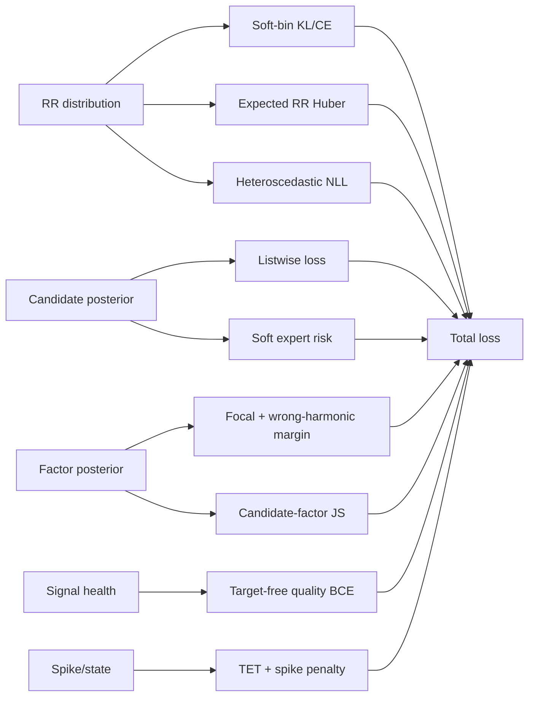

### 11.2 권고 loss stack

| loss | 목적 | 적용 mask |
|---|---|---|
| Gaussian soft-bin KL/CE | RR posterior | reference-valid |
| SmoothL1 expected RR | robust scalar 정확도 | reference-valid |
| Heteroscedastic NLL | sample별 scale | reference-valid |
| Teacher KL/feature KD | 작은 데이터 안정화 | teacher confidence gate |
| Candidate listwise | 후보 순위 | candidate+reference valid |
| Soft expected expert risk | router selection gradient | expert available |
| Factor focal | 희귀 ×2/×3/×4 | confident factor만 |
| Wrong-harmonic margin | catastrophic factor 억제 | confident factor만 |
| Factor-candidate JS | 두 posterior 일관성 | support 존재 |
| Target-free quality BCE | missing/flatline/multimodal | radar-only label |
| Soft CVaR20 | tail error | warmup 이후 |
| TET | step별 일관성 | supervised step |
| Spike penalty | firing-rate proxy | 정확도 안정화 이후 |

hard argmax prediction에만 CVaR를 걸면 router 선택에 gradient가 흐르지 않는다. CVaR와 risk는 soft expert cost에 적용하고 inference만 hard하게 만든다.

### 11.3 sampling

```text
1. physical identity별 총 sampling mass 동일화
2. identity 내부 RR band를 완만하게 reweight
3. high-RR episode oversample
4. session chunk chronological order 보존
5. invalid-reference window는 state update, supervised loss 0
```

### 11.4 augmentation 선택

| 채택 | 조건부 | 금지 |
|---|---|---|
| whole-radar dropout | 작은 causal time jitter | 사람/session 간 window mix |
| gain scaling | physical RR-consistent warp | target 고정한 큰 frequency warp |
| packet loss/flatline | frozen I/Q phase inversion | future-aware smoothing |
| impulsive noise | range-bin shift | reference에 peak를 맞추는 조작 |
| partial corruption | range confidence corruption | target-selected SVD injection |

### 11.5 학습 curriculum

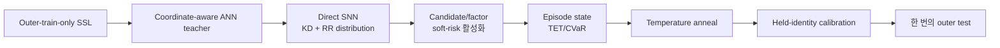

비교 budget은 epoch보다 fixed optimizer update를 우선한다. session chunk와 gradient accumulation이 다른 모델을 같은 epoch로 비교하면 실제 학습량이 달라진다.

---

## 12. WP9 — 평가, calibration, 상용 gate

### 12.1 평가 funnel

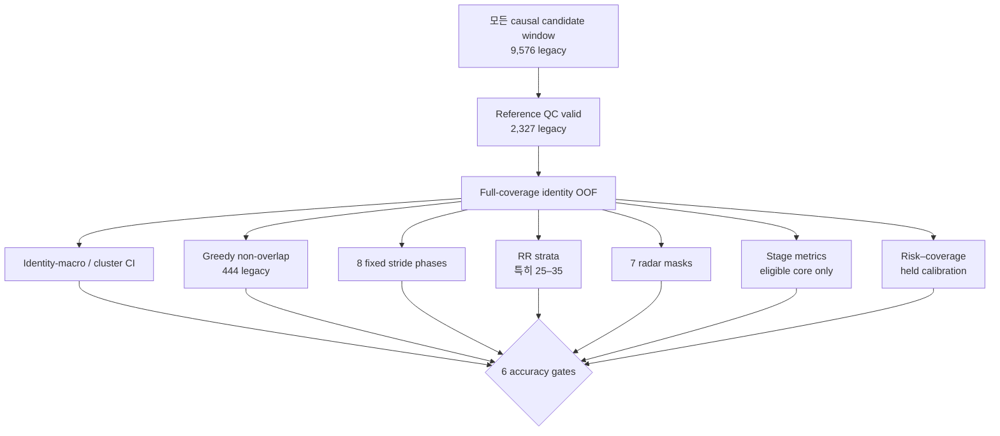

숫자는 historical legacy cache population이다. corrected cache에서는 window와 valid count가 바뀔 수 있으므로 새 version으로 보고한다.

### 12.2 내부 정확도 gate

| 지표 | 목표 | 현재 historical leader | 상태 |
|---|---:|---:|:---:|
| Overall MAE | ≤1.00 bpm | 1.291 | FAIL |
| Identity-macro MAE | ≤1.00 bpm | 1.220 | FAIL |
| RMSE | ≤1.80 bpm | 2.410 | FAIL |
| ±2 bpm | ≥90% | 80.79% | FAIL |
| >5 bpm | ≤3% | 6.23% | FAIL |
| 25–35 bpm MAE | ≤2.00 bpm | 4.216 | FAIL |

세 고정 seed 모두가 여섯 gate를 통과해야 내부 engineering pass다. 평균 seed나 최고 seed로 실패 seed를 숨기지 않는다.

### 12.3 겹친 window를 다루는 법

32초 window, 4초 stride는 87.5%가 겹친다. identity split은 사람 누수를 막지만 row를 독립 sample로 만들지는 않는다.

필수 보고:

- full valid windows
- greedy non-overlap windows
- 8 fixed temporal phases
- identity-macro metric
- identity-cluster bootstrap CI
- episode/session aggregation

### 12.4 uncertainty calibration

분리할 값:

- posterior entropy
- aleatoric scale
- direct/candidate disagreement
- radar-view disagreement
- predicted `P(|error|>2/5)`
- output availability

threshold는 outer-test quantile로 정하지 않고 held-identity validation에서 잠근다. selective 성능은 coverage, high-RR retention, identity별 rejection, false-safe/false-unsafe를 같이 보고한다.

### 12.5 상용 claim까지의 상태 사다리


현재 위치는 첫 단계다.

---

## 13. WP10 — Streaming, 장애 대응, 배포

### 13.1 runtime state

| state | 의미 | reset 조건 |
|---|---|---|
| Simulation membrane | 한 window 내부 8–12 step | 매 window 또는 명시된 carry policy |
| Episode PLIF/ALIF | 과거 4초 stride window의 지속 정보 | session change, 큰 gap, clock discontinuity |
| Radar availability | 현재 view 결측 | reset하지 않고 mask로 전달 |
| Candidate track | harmonic 선택 hysteresis | 위험 증가·전환 근거·gap |

### 13.2 장애 기술

| 장애 | 필요한 처리 | 평가 |
|---|---|---|
| Radar 1/2/3 전체 결측 | availability mask + fallback | 7 non-empty masks |
| Partial packet loss | corruption detection + masked feature | burst injection |
| Flatline | signal-health head | duration별 fault test |
| Time jitter/drift | measured-time resampler | bounded injection |
| Range multimodal | uncertainty/no-estimate | multi-peak strata |
| All sources unavailable | numeric RR 출력 금지 | fail-closed test |
| Stateful NaN/overflow | state reset + alarm | long-run soak test |

### 13.3 energy와 latency

현재 CUDA/PyTorch spike rate는 energy proxy일 뿐이다.

```text
필요한 실제 증거:
  parameter / memory footprint
  dense MAC와 spike event operation
  CPU/CUDA latency
  target device latency
  memory traffic
  wall power와 joule/inference
  32초 context를 포함한 end-to-end latency
```

낮은 firing rate만으로 “ANN보다 전력 효율이 좋다”고 주장하지 않는다.

### 13.4 release fail-safe

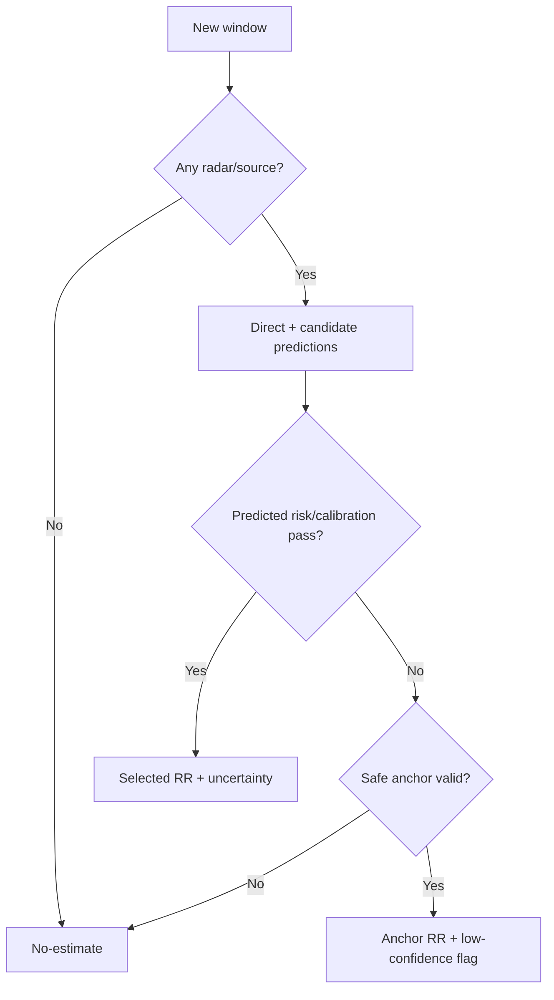

---

## 14. 작업 의존성과 병렬 실행 구조

### 14.1 반드시 순서가 필요한 gate

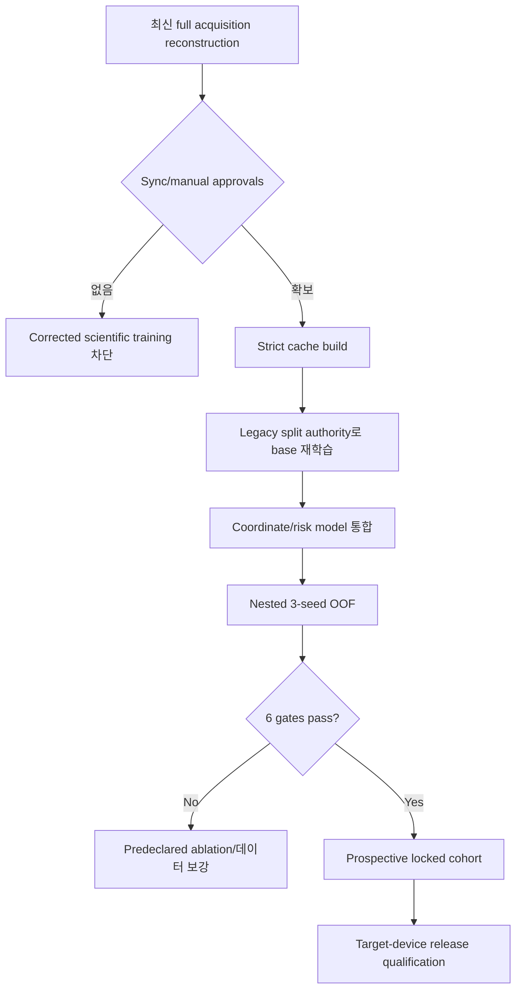

### 14.2 병렬화할 수 있는 작업

| 병렬 트랙 | 선행 조건 | 산출물 |
|---|---|---|
| P-A: sync 수동 검토 도구/receipt | raw reconstruction | 승인 manifest |
| P-B: strict loader/train 연결 | acquisition contract | fail-closed entrypoint |
| P-C: range_aux model 연결 | range artifact | masked input path |
| P-D: coordinate-interaction unit tests | 571-layout contract | swap/equivariance tests |
| P-E: soft-risk router prototype | existing candidates | differentiable selection test |
| P-F: outer-train SSL prototype | frozen split | encoder checkpoint |
| P-G: device benchmark harness | current leader | latency/memory/spike baseline |

P-B~P-G는 scientific score를 주장하지 않는 범위에서 P-A와 병렬 개발할 수 있다. corrected full training은 P-A와 strict cache가 모두 통과한 뒤에만 열린다.

### 14.3 우선순위

| 우선순위 | 작업 | 이유 |
|:---:|---|---|
| P0 | full source-consistent acquisition reconstruction과 sync authority | 잘못된 label clock에서는 모든 모델 비교가 무의미 |
| P0 | strict training entrypoint와 provenance closure | 승인 없는 데이터를 실수로 학습하는 경로 차단 |
| P1 | historical leader의 corrected baseline 재학습 | 새 모델의 공정한 비교점 확보 |
| P1 | coordinate-interaction + soft-risk router | 확인된 구조·loss 병목을 직접 해결 |
| P1 | high-RR identity/factor 데이터 확보 | 42 non-overlap tail sample 한계 해결 |
| P2 | split-safe SSL, range_aux, stateful episode | 데이터 효율과 지속성 보완 |
| P2 | small attention, conversion, local learning ablation | 주 구조 이후 비교 |
| P3 | neuromorphic port와 실제 energy | accuracy/safety 후보 고정 후 수행 |

---

## 15. 기술 선택 근거를 한 표로 최종 정리

| 파트 | 우리가 해결할 문제 | 선택 기술 | 왜 맞는가 | 사용하지 않을 대안 |
|---|---|---|---|---|
| Parser | header 혼입·corruption | explicit 3-header+182-float schema | raw 형식이 고정이고 오류가 확인됨 | FL=185 float parser |
| Timing | drift/jitter/plateau | measured metadata timeline | nominal index보다 실제 취득을 반영 | nominal-only |
| Sync | radar-reference offset/drift | content-bound marker affine + manual approval | 실험 자체에 marker gesture가 있음 | 호흡 target correlation |
| Reference | noisy/clipped RSP | FFT+IBI+phase consensus QC | 서로 다른 estimator failure 교차검사 | FFT 하나 |
| Stage | protocol 시간 불확실성 | ordered DP + anchor + core eligibility | 일곱 phase 순서와 문서 불일치 처리 | session action broadcast |
| Denoising | trend/motion/noise | causal robust FFT + SVD evidence | 작은 데이터에서 설명 가능하고 label-free | 큰 neural denoiser 우선 |
| Range | 사람 쪽 bin 선택 | causal active range tracker | target-free 위치 evidence 제공 | person ID/미터 위치 주장 |
| Base | 전체 RR 안정성 | structured hybrid TriRadarRRSNN | 현재 OOF leader이며 safe anchor 가능 | full-map Poisson SNN |
| Candidate | harmonic ambiguity | candidate set + directed graph | oracle 상한은 좋고 선택이 병목 | scalar correction |
| Coordinate | radar/ratio 의미 보존 | concat/FiLM joint interaction | 기존 additive pooling 불변성 해결 | embedding add+mean |
| Router | catastrophic 선택 | soft expected-risk train, hard-safe deploy | 선택 logit에 gradient 전달 | hard argmax CVaR-only |
| Neuron | 낮은 step state | PLIF graph + ALIF episode | time constant/adaptation 학습 | fixed LIF only |
| 학습 | end-to-end RR/router | surrogate BPTT | dense radar와 supervised routing에 적합 | STDP-only |
| 보조학습 | 작은 label cohort | KD + outer-train SSL + TET | soft target·unlabeled data·낮은 T 활용 | test-transductive SSL |
| Output | 다봉·불확실 RR | distribution + risk/availability | scalar보다 ambiguity와 거부 표현 | scalar 하나 |
| Split | 반복 사람·window overlap | physical-identity nested OOF | unseen person 누수 차단 | random window split |
| Release | 위험한 값 출력 | safe anchor/no-estimate | 상용 시스템은 coverage와 안전이 필요 | 항상 numeric 출력 |

---

## 16. 무엇이 구현됐고 무엇이 아직 제안인가

| 계층 | 항목 | 증거 수준 |
|---|---|---|
| 측정된 leader | Structured + exact two-SNN ensemble | ✅ 6-fold historical OOF, 0/6 gate |
| 측정된 후보 | SVD source/temporal/episode | ✅/🟡 측정됐으나 leader 미갱신 |
| 측정된 후보 | HCES v2 | ✅ 3-seed full OOF 실패 |
| 부분 후보 | DHFER v3r1 | 🟡 H0 discovery, full OOF/authorization 미완료 |
| 데이터 인프라 | timing/sync/protocol/range/acquisition contract | 🟡 구현·집중 test, full strict data 미완료 |
| 통합 gap | strict `train.py`, `range_aux` input | 🟡 구현 연결 필요 |
| 권고 구조 | coordinate-interaction CCHG-SNN | 🔵 미통합·미측정 |
| 권고 loss | soft expert risk + TET + target-free quality | 🔵 미통합·미측정 |
| 권고 pretrain | outer-train-only SSL | 🔵 full nested 결과 없음 |
| 상용 증거 | prospective cohort/device faults/energy | 🛑 없음 |

증거 수준의 순서는 다음과 같다.

```text
문헌상 타당한 제안
  < unit/synthetic test
  < discovery validation
  < identity-disjoint full OOF
  < locked prospective cohort
  < target-device release evidence
```

oracle은 표현 상한 진단일 뿐 이 사다리의 배포 성능 단계에 포함되지 않는다.

---

## 17. 완료 정의

프로젝트가 “모델 하나가 학습됐다”에서 끝나지 않도록 완료를 계층별로 정의한다.

### 데이터 완료

- 최신 source로 29 usable session reconstruction
- sync authorization/manual approval와 exact content binding
- strict cache·range·stage provenance
- frozen physical-identity split

### 모델 완료

- corrected base와 CCHG-SNN의 3-seed 6-fold OOF
- 모든 후보가 validation lock을 지킴
- six accuracy gates 동시 통과
- 7 radar masks, non-overlap, phase, tail 결과

### 불확실도 완료

- held-identity calibration
- coverage와 high-RR retention 사전 잠금
- no-estimate safety와 catastrophic risk 검사

### 상용 후보 완료

- 독립 prospective identities
- 독립 reference와 hardware sync
- target-device latency/memory/energy
- packet loss, flatline, placement, motion fault injection
- shadow/canary/rollback plan과 immutable release manifest

현재는 데이터 authority와 내부 모델 개선을 동시에 준비하는 `research candidate` 단계다. corrected OOF와 prospective evidence가 없으므로 상용 성능 달성이라고 결론 내리지 않는다.

---

## 18. 최종 권고

가장 중요한 판단은 다음 다섯 문장으로 정리된다.

1. **먼저 데이터 clock을 잠근다.** 최신 full reconstruction과 sync approval 없이 새 성능 학습을 열지 않는다.
2. **현재 leader를 버리지 않는다.** structured TriRadarRRSNN을 direct posterior, teacher, safe anchor로 유지한다.
3. **모델의 핵심 개선은 크기가 아니라 routing 방식이다.** evidence와 radar/ratio 좌표를 pooling 전에 결합하고 soft risk로 candidate 선택을 학습한다.
4. **SNN은 짧고 직접 학습한다.** analog front-end 뒤 8–12 step PLIF/ALIF를 surrogate gradient, KD, TET로 학습한다.
5. **상용 성능은 prospective 증거로만 확정한다.** 같은 18명 OOF의 추가 tuning이나 oracle 수치로 대체하지 않는다.

이 선택은 현재 관찰된 두 사실을 동시에 반영한다.

- 기존 structured hybrid SNN은 전체 범위에서 가장 안정적인 기반이다.
- candidate oracle과 실제 router 사이의 큰 차이는 다음 성능 도약이 harmonic selection과 독립 high-RR data에서 나와야 함을 보여준다.
