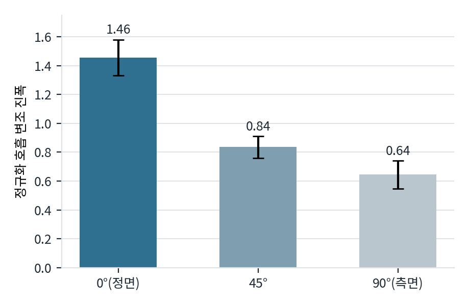

# 01. 실험 연대기

한 세션 동안 진행한 실험을 **시간 순서대로** 적습니다.
각 항목은 **왜 했는지 → 무엇을 했는지 → 결과 → 그래서 무엇을 결정했는지** 순입니다.

> 실험을 **하나씩 따로** 보시려면 [`experiments/`](experiments/) 폴더로 가세요 —
> 실험마다 폴더가 하나씩 있고, 그 안에 그 실험만의 보고서가 있습니다.
> 이 문서는 같은 내용을 한 페이지로 이어 읽는 판입니다.

---

## 1. 행동 7분류 SNN (첫 시도)

**왜.** "지금까지 확보된 데이터로 SNN을 학습시켜 달라"는 요청. 당시 쓸 수 있다고 판단한 9명의
피험자에 대해 7개 시나리오(자세·호흡·픽업·낙상·지그재그·왕복·자율) 구간이 잘려 있었음.

**무엇.** 구간별 레이더 움직임 신호를 스파이크로 인코딩(delta / rate / direct)해 7분류.
ANN 기준선도 함께.

**결과.** 최고 81.5%.

**결정.** 이 수치는 **나중에 무효 처리**했다. 아래 3번에서 원시 데이터를 잘못 읽고 있었음이
드러났기 때문. 크기(magnitude)만 쓰고 위상은 망가진 상태였다.

---

## 2. 과제 재정의 — 각도를 표본으로

**왜.** 사용자가 지적: 레이더 3대가 45°씩 벌어져 있으므로, 피험자가 한 레이더를 응시할 때
**나머지 두 대는 각각 다른 상대각을 본다**. 그러면 블록 하나가 표본 3개가 되고, 입력이
레이더 한 대로 줄어든다.

**무엇.** 관측 각도표를 정리.

| 응시 방향 | 레이더1 | 레이더2 | 레이더3 |
|---|---|---|---|
| 1번 | 0° | +45° | +90° |
| 2번 | −45° | 0° | +45° |
| 3번 | −90° | −45° | 0° |

**결정.** 부호(±)는 목표에서 제외. 표를 세로로 읽으면 **레이더1은 음의 각도만, 레이더3은
양의 각도만** 본다. 부호가 레이더 정체성과 완전히 상관되어 있어, 5분류로 두면 모델이
"몇 번 레이더인지"를 외워서 부호를 맞힐 수 있다. 그래서 |각도| ∈ {0°, 45°, 90°} 3분류.

---

## 3. I/Q 파싱 오류 발견 — 이 세션에서 가장 중요한 발견

**왜.** 각도 과제의 물리적 타당성을 확인하려고 레이더별 가슴 위치를 재던 중, 모든 레이더에서
호흡 대역 봉우리가 **정확히 46 bin 간격으로 두 개씩** 나타났다. 46은 전체 92 bin의 절반.
물리적 반사로는 나올 수 없는 규칙성이라 검증에 들어갔다.

**무엇.** 실제 파일로 세 가지 파싱을 비교 ([`preprocess/ghost.py`](../../analysis/uwb-snn-2026-09-01/preprocess/ghost.py)).

| 파싱 방식 | 복소 복원 규칙 | 호흡대역 피크 | 판정 |
|---|---|---|---|
| A · 인터리브 (원본 코드) | `d(:,1:2:end) + 1i*d(:,2:2:end)` | bin 14~16 **그리고** 59~60 | 같은 표적이 46 bin 떨어져 중복 |
| **B · 전후분할 (채택)** | `d(:,1:92) + 1i*d(:,93:end)` | bin 28~32 — 봉우리 하나 | 물리적으로 타당 |
| C · 복소 아님 | 184개를 모두 실수 bin으로 | bin 28~32 **그리고** 123~127 | 앞·뒤 블록에 같은 표적 → 구조 증명 |

**결과.** 한 프레임 185개 값은 `[프레임 카운터][실수 92][허수 92]` 구조.
원본 코드(`sync_tool_S02.m` 190번 줄)는 짝수·홀수 위치에서 번갈아 뽑아 복소수를 만들고 있었다.

**검증.** 수정 후 레이더에서 뽑은 호흡 주파수가 BIOPAC과 일치.
S05 0.186 vs 0.176 Hz · S03 0.107 vs 0.117 Hz · S09 0.244 vs 0.244 Hz.

**결정.** 전 피험자 재처리. 1번 실험 결과는 폐기.
**주의: 이는 신호처리 기법이 아니라 파일을 올바르게 읽는 문제였다.**
논문들은 애초에 제대로 분리된 I/Q를 받는 데서 시작한다. 우리는 그 출발선에 서지 못했던 것.

---

## 4. 배치 기하 확인

**왜.** 각도 해석과 레이더 간 비교를 하려면 거리 관계를 알아야 함.

**무엇.** 레이더는 바닥 정사각형 테이프의 윗변 중앙(r1) · 꼭짓점(r2) · 오른변 중앙(r3),
의자는 중심. 수정한 파싱으로 1번 구간의 가슴 bin을 측정.

| | r1 | r2 | r3 | r2/r1 | r1/r3 |
|---|---|---|---|---|---|
| 측정 중앙값 (8명 일관) | 29 | 39 | 31 | 1.33 | 0.94 |
| 정사각형 기하 예측 | — | — | — | 1.41 | 1.00 |

**결과.** 예측보다 1 쪽으로 눌린 것은 케이블·전자 지연이 상수로 더해지기 때문.
상수를 풀면 의자~레이더 약 1.2 m, 정사각형 한 변 약 2.5 m.

**결정.** **r1과 r3이 등거리(비율 0.94)** 라는 사실을 확보. 나중에 "각도의 물리를 배웠는가,
레이더별 잔재를 외웠는가"를 가르는 교차 검증에 사용.

---

## 5. offset 추정 3전 3패 → 지형지물 정박으로 전환

**왜.** BIOPAC 라벨을 레이더에 옮기려면 두 장비의 시각 차(offset)를 알아야 함.

**무엇 & 결과.**

| 시도 | 방법 | 결과 |
|---|---|---|
| ① | 마커 시각을 레이더 움직임 봉우리에 얹어 점수 최대화 | 전·후반부 추정이 ±20초씩 어긋남. 레이더 3대가 서로 다른 값 |
| ② | 레이더별 최대로 채점 (평균 희석 제거) | 희석은 풀렸으나 봉우리가 서지 않음 (신뢰도 0~1.6) |
| ③ | 레이더 호흡 파형 ↔ BIOPAC 상호상관 | 주파수는 일치하나 상관 0.1~0.35. 1번 구간에서 65초마다 몸을 돌려 위상 연속성이 끊김 |

**결정.** **offset을 구하는 대신, 라벨 경계를 레이더 신호에서 직접 찾는다.**

- 실험 1: 몸을 돌릴 때 생기는 **움직임 봉우리 2개** (28명에서 61.0~63.3초 간격)
- 실험 2: 숨 참는 30초 동안의 **호흡 진폭 붕괴**

함정 하나: 시작마커·회전1·회전2·종료마커가 **모두** 약 62초 간격이라 아무 쌍이나 잡으면
역할이 밀린다. "회전1은 녹화 후 50~120초"라는 제약을 넣자 잘못 잡힌 4명이 모두 교정.

**교차 검증.** 레이더로 잡은 무호흡과 BIOPAC에서 잡은 무호흡이 **중앙값 1.1초(σ 4.5초)** 안에서 일치.
25명 전원에서 호흡 진폭이 기준선의 3~13%(중앙값 7%)로 붕괴.

---

## 6. 학습 전 물리 검증 (통과 조건)

**왜.** 신호 수준에서 각도가 보이지 않으면 학습은 시간 낭비. 학습 전에 통과 조건으로 둠.

**무엇.** 피험자·레이더별로 3블록 평균을 1로 정규화한 호흡 변조 진폭.

| 각도 | 진폭 | 95% 신뢰구간 |
|---|---|---|
| 0° (정면) | 1.456 | ±0.064 |
| 45° | 0.836 | ±0.039 |
| 90° (측면) | 0.645 | ±0.049 |

t검정 — 0 vs 45: p=1.5e−15 · 45 vs 90: p=4.0e−03 · 0 vs 90: p=5.6e−16.
**28명 전원**이 0°/90° 비율 1 초과 (중앙값 2.67배).

**결정.** 통과. 학습 진행.

---

## 7. 과제 A(각도) · B(호흡상태) 학습

**무엇.** 스파이크 인코딩 5종 × 디코딩 3종을 두 과제에서 비교.

**결과 — 과제 A (|각도| 3분류, 28명, 우연 33.3%)**

| 인코딩 | 정확도 | macro F1 |
|---|---|---|
| rate | 71.1 ± 1.2 | 0.723 |
| step-forward | 69.9 ± 2.3 | 0.717 |
| population | 68.5 ± 1.3 | 0.720 |
| delta | 65.7 ± 2.0 | 0.678 |
| direct (아날로그) | 55.8 ± 4.7 | 0.616 |

디코딩: 발화수 72.3% · 최초발화 71.6% · 막전위 71.1%.

*두 과제에서 인코딩 순위가 동일하다 — rate > step-forward > population > delta > direct.
뒤의 회귀 과제(호흡수)에서는 이 순서가 유지되지 않는다([05_모델실험.md](05_모델실험.md)).*

**결과 — 과제 B (호흡상태 6분류, 25명, 우연 16.7%)**
rate 62.1% 최고. 인코딩 순위가 과제 A와 **완전히 동일**.

혼동행렬: [assets/c_cmB.png](assets/c_cmB.png)

**추가 검증.**
- 레이더 교차 일반화: r1 학습 → r3 검증 74.9% (등거리). r1+r3 → r2 58.3% (거리 1.41배)
- 45° 외삽: 0°/90°만 학습 후 미학습 45° 예측 → 중앙값 34.3°

**주의.** 이 수치들은 뒤에 방법론 문제(평가셋 훔쳐보기)가 발견되기 전에 나온 값이다.
16번 항목 참조.

---

## 8. 회복 호흡 라벨 정정

**왜.** 사용자 지적: "평소 호흡과 회복 호흡이 신호상 같다"는 서술이 생리적으로 이상하다.
숨을 참았다 회복하려면 더 많은 호흡이 필요하지 않은가.

**무엇.** BIOPAC으로 무호흡 종료를 0초로 맞춰 25명의 호흡 진폭·호흡률 재측정
([`analysis/recov.py`](../../analysis/uwb-snn-2026-09-01/analysis/recov.py)).

| 구간 | 진폭비 (중앙값) | 호흡률 차이 | 진폭 15% 이상 증가 |
|---|---|---|---|
| 평소 호흡 (기준) | 1.00 | — | — |
| 무호흡 후 0~20초 | **1.35** | +0.0 /분 | 17 / 25명 |
| 20~40초 | 1.09 | +1.0 /분 | 10 / 25명 |
| 40~60초 | 1.03 | +2.0 /분 | 7 / 25명 |
| 60~80초 | 0.99 | +3.0 /분 | 9 / 25명 |

**결과.** 지적이 맞았다. 회복 반응은 실재한다. 다만 **빨라지는 게 아니라 깊어진다** —
호흡률은 거의 그대로인데 진폭이 1.35배. 그리고 **20~40초면 평소 수준으로 돌아온다.**

**결정.** 초판 서술 철회. 혼동의 진짜 원인은 생리가 아니라 **라벨 구간을 62초로 잡은 것**.
실제로 구분되는 구간은 앞의 20초뿐이라, 라벨의 3분의 2가 이미 평소 호흡으로 돌아온 신호였다.

---

## 9. 문헌 조사 → 과제 방향 전환

**왜.** "각도 맞히기가 별로인 것 같다. 다른 논문은 이런 데이터로 뭘 측정하나?"

**무엇.** 레이더 vital-sign 문헌 검색.

**결과.** **각도 자체를 목표로 삼는 논문은 거의 없다.** 몸 방향은 보통 *맞혀야 할 답*이 아니라
*극복해야 할 방해 변수*로 다뤄진다 ("angular-free" 모니터링, cross-position generalization).
표준 과제는 호흡수 추정과 호흡 패턴 분류(eupnea·bradypnea·tachypnea·apnea 등).

우리 데이터의 호흡수 범위를 재보니 **4.8 ~ 31.9 회/분**. 대부분 논문이 앉아서 쉬는
10~20회/분만 다루는 것에 비해 두 배 넓다 — 느린 호흡과 스쿼트를 넣은 프로토콜 덕분.

**결정.** 주 과제를 **호흡수·파형 복원**으로 전환. 각도는 목표가 아니라 **보정 수단**으로 이동.

---

## 10. 회의 피드백 반영

**왜.** 2026-08-31 회의 녹취록과 피드백 문서를 받음.

**무엇 & 결과.**

| 피드백 | 확인 결과 |
|---|---|
| "위아래로 뜨는 한 쌍은 line-of-sight와 고스트다. 둘 다 써라" | **그 한 쌍은 I/Q였다.** 간격이 정확히 92 bin(블록 크기)이고, 87건 전부에서 같은 거리. 멀티패스라면 더 먼 거리에 나타나야 함. 다만 두 줄의 파형 상관은 −0.15로 실제로 다르고, 합쳐야 호흡이 복원된다 — 조언의 실질은 맞았다 |
| 진짜 멀티패스는? | 파싱 수정 후에도 **레이더 3의 +30 bin에 2차 반사**가 일관되게 존재 (범위 +28~+32, 세기 0.43, 49%가 같은 호흡 주파수) |
| 환경 파일로 배경 제거 | **빈 방 녹화가 데이터에 없음.** 대체법(SVD 지배성분 제거)은 오히려 악화 (1.08 → 3.63). 나중에 MoRe-Fi의 되먹임 필터로 해결 |
| BIOPAC 이상 피험자 확인 | 25회/분 초과 **0명**. 주기 변동계수 최대 0.27로 전원 규칙적 |
| S01_CMS | **본 녹화가 12.5초(501프레임)** — 실험이 담기지 않음 |
| I/Q 위상 보정 | 타원 적합으로 구현·시험. 느린 호흡에서 크게 개선(0.81→0.09)되나 체동 구간에서 무너져 전체로는 손해 |

---

## 11. 기준선 확정

**왜.** 모델이 무엇을 이겨야 하는지 정해야 함. 학습 없는 고전 신호처리부터.

**무엇.** 가슴 bin 탐지 → I/Q 주성분 투영 → 대역통과 → 스펙트럼 정점(포물선 보간)
→ 레이더 3대 중앙값 융합. 상세는 [04_기준선.md](04_기준선.md).

**결과 (30초 창 기준, 최종).** 지형지물 1.61 · 마커 1.86 회/분.

**중요한 관찰.** 매 순간 3대 중 옳은 것을 고를 수 있다면 **0.32~0.46**까지 내려간다.
그리고 최선이었던 레이더가 1번 38회 · 2번 36회 · 3번 38회로 **거의 균등**하다 —
고정 규칙으로는 닿을 수 없고, 시점마다 판단해야 한다.

**결정.** 모델의 임무를 "호흡을 읽는 것"이 아니라 **"어느 추정을 믿을지 고르는 것"**으로 정의.

---

## 12. 후보 선택기

**무엇.** 레이더 3대 × 복조 3방식(선형 투영 / 원적합+arctan / 타원적합+arctan) = **후보 9개**.
각 후보의 신뢰도를 SNN이 채점해 하나를 고름.

**결과.** 1.18 회/분 (당시 방법론 기준). 기준선 1.66 대비 개선.

**절제 실험.** 파형만 주면 SNN은 1.79로 기준선도 못 넘음. 손으로 만든 신뢰도 특징만으로 1.34.
둘 다 쓰면 1.18. → **이득의 대부분이 특징에서 나왔다.**

---

## 13. end-to-end 시도와 실패

**왜.** "후보 고르기는 SNN이 할 일이 아니다"는 판단. 신호를 직접 읽게 해야 한다.

**무엇 & 결과.**

| 시도 | 창 | MAE | 1회/분 이내 |
|---|---|---|---|
| 평균만 답하기 (하한) | 784 | 5.87 | 11% |
| 호흡수 직접 예측 | 784 | 5.26 | 15% |
| 호흡수 직접 예측 (데이터 5배) | 3,696 | 5.03 | 19% |
| 파형 출력 (위상 둔감 손실) | 3,696 | 6.42 | 41% |
| 고전 신호처리 | 3,696 | **1.55** | **80%** |

**결과.** **완전히 실패.** 데이터를 5배로 늘려도 5.26 → 5.03으로 제자리.
파형 출력은 1회/분 이내가 19% → 41%로 두 배가 됐지만(정답을 100배 풍부하게 준 효과)
평균 오차는 오히려 커짐. 파형 상관 0.456 (논문 0.916).

**원인.** 데이터 규모. MoRe-Fi는 66시간·8,000쌍으로 학습했고 우리는 앉아서 호흡한 구간만
따지면 2시간 남짓이다.

---

## 14. MoRe-Fi 정독

**왜.** 앞선 실패 후, 선행연구를 제대로 읽지 않고 설계했다는 것이 문제로 지적됨.

**무엇.** MoRe-Fi (SenSys 2021, arXiv 2111.08195) 본문 확인.

**결과 — 우리 설계가 왜 틀렸는지가 논문에 그대로 적혀 있었다.**

- 타원 적합은 **"정지 상태 피험자를 위해 설계된 것"**이라 움직이면 실패한다
- **"진폭이나 위상 어느 쪽 파형도 호흡을 제대로 표현하지 못한다"** — 1차원 투영을 명시적으로 거부

우리가 만든 후보 9개는 **전부 그 1차원 투영**이었다.

**논문이 실제로 하는 것.**

| | |
|---|---|
| 배경 제거 | 되먹임 필터 (β=0.9). **빈 방 녹화 불필요** |
| 사람 찾기 | CFAR |
| 입력 | 봉우리 주변 여러 거리 칸의 I·Q를 **각각 다채널 시퀀스로** (1000×138). 1차원으로 압축하지 않음 |
| 증강 | I/Q 평면에서 0~2π를 π/30 간격으로 60회 회전 |
| 구조 | I·Q 두 스트림 인코더(1D CNN 5층) → 잠재공간 정렬 → 디코더 |
| 출력 | **호흡 파형**. 호흡수는 FFT로 파생 |
| 평가 | 코사인 유사도 (평균 0.9162) |
| 규모 | 12명 · 66시간 · 학습 8,000쌍 / 시험 4,000쌍 · 파라미터 2,360만 |

**결정.** 되먹임 필터 배경 제거를 도입 (기준선 1.66 → 1.55로 개선).
입력 형태도 논문 방식으로 교정. 다만 모델 규모는 우리 데이터에 맞게 축소.

---

## 15. 마커 vs 지형지물 전면 비교

**왜.** 지형지물로 자른 것이 마커 기반보다 나은지 확인 필요. 그리고 **이전 세션에서 팀과 함께
만든 `HAI_동기화_종합.xlsx`에 마커 기반 구간이 이미 정리되어 있었다** — 처음에는 이 파일을
쓰지 않고 즉석 규칙(3번째 마커)으로 비교해 마커 쪽에 불리한 결과를 냈다. 지적받고 교정.

**무엇.** 그 파일의 실험2 구간(레이더 시간)을 기준으로 자른 것과, 지형지물로 자른 것을
동일한 고전 추정기로 비교. 상세는 [03_동기화.md](03_동기화.md).

**결과 (공통 21명, 창 각 588개).**

| | MAE | 1회/분 이내 |
|---|---|---|
| 마커 기반 | 1.78 | 74% |
| 지형지물 기반 | **1.33** | **82%** |

21명 중 13명에서 지형지물이 나음. 구간별로는 **평소 호흡에서 차이가 제일 크고**(2.24 vs 0.65),
회복 호흡에서는 오히려 마커가 낫다.

**마커 검증.** "몇 번째 마커"가 아니라 "가장 가까운 마커"로 대조하면 **21명이 5초 안에서 일치**
(실험1 시작 +4.8초, 종료 −5.2초, 실험2 시작 +4.1초, 표준편차 3.3~3.4초).
계통적으로 몇 초 어긋나는 것은 정의 차이(마커는 실험 시작 순간, 우리 블록은 회전 봉우리 기준).

**마커가 불안정한 이유.** 마커 개수가 **5개에서 48개까지** 제각각 (기대 20~22개).
"3번째 마커가 실험2 시작" 같은 규칙이 성립하지 않는다.

**결정.** 지형지물로 자르고, **마커로 검증**하고, 안 맞는 사람을 걸러낸다.

---

## 16. 방법론 교정 — 평가셋 훔쳐보기

**왜.** "학습이 이렇게 작아도 되냐, early stopping 해야 하는 것 아니냐"는 지적.

**무엇.** 코드를 확인하니 매 에폭마다 **평가 폴드**에서 성능을 재고 그중 최고를 결과로 쓰고 있었다.
이는 early stopping이 아니라 **평가셋으로 에폭을 고르는 것**이며 결과가 부풀려진다.

**교정.** 피험자를 **학습/검증/평가 3분할**. 에폭은 검증셋으로만 고르고(조기종료, 상한 60·인내 10),
평가셋은 마지막에 한 번만 본다.

**결과.** 수치가 바뀌었다.

| | 이전 (부풀려짐) | 교정 후 |
|---|---|---|
| 마커 · ANN | 1.53 | **1.77** |
| 지형지물 · ANN | 1.24 | **1.53** |
| 지형지물 · SNN 최고 | 1.13 | **1.18** |

**그리고 결론이 바뀌었다.** 이전에는 ANN과 SNN이 거의 같았는데(1.24 vs 1.13),
교정 후에는 **SNN이 확실히 앞선다**(1.53 vs 1.18). 조기종료 에폭을 보면 ANN은 평균 10.3에폭에서
멈추고 성적 상위 인코딩은 delta 19.5, rate 29.5까지 간다 — ANN이 더 빨리 과적합한다.
다만 population은 평균 6.8에폭으로 더 일찍 멈추면서 성능은 ANN보다 좋다 —
"오래 학습되면 좋다"는 단순 대응은 성립하지 않는다.

**최종 12조합 결과는 [05_모델실험.md](05_모델실험.md).**
