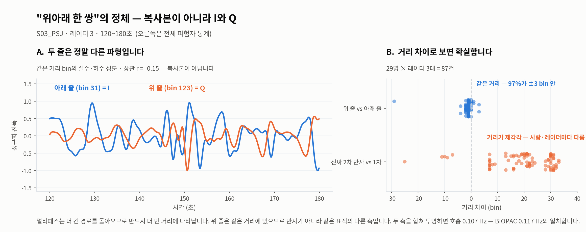

# 02. 데이터와 전처리

## 원시 데이터 구조

UWB 레이더는 전파 펄스를 쏘고 돌아온 신호를 **복소수**로 기록한다.
파동의 세기뿐 아니라 **위상**까지 담아야 하므로 두 개의 숫자가 필요하다.

- **I** — 기준 파동과 나란히 놓고 잰 값
- **Q** — 기준 파동을 90° 돌려놓고 잰 값

(I, Q)를 좌표로 찍으면 평면 위의 점이 되고, 원점에서의 거리가 반사 세기, 각도가 위상이다.

**왜 위상이 중요한가.** 호흡으로 가슴이 움직이는 거리는 몇 mm인데 레이더 거리 칸 하나는 몇 cm다.
거리로는 안 보인다. 반면 전파 파장이 수 cm이라 몇 mm 움직임도 위상을 크게 돌린다.
**호흡은 세기가 아니라 위상에 실린다.**

파일 형식: 한 프레임 = 185개 float32 = `[프레임 카운터][실수 92][허수 92]`, 40 fps.

---

## I/Q 파싱 오류 (발견 및 수정)

### 발견 경위

각도 과제의 물리 검증 중, 모든 레이더에서 호흡 대역 봉우리가 **정확히 46 bin 간격으로 두 개씩**
나타났다. 46은 92의 절반. 물리적 반사로는 나올 수 없는 규칙성.

### 검증

실제 파일로 세 가지 파싱을 비교했다 ([`preprocess/ghost.py`](../../analysis/uwb-snn-2026-09-01/preprocess/ghost.py)).

| 방식 | 규칙 | 결과 | 판정 |
|---|---|---|---|
| A · 인터리브 | `d(:,1:2:end) + 1i*d(:,2:2:end)` | bin 14~16 **그리고** 59~60 | 같은 표적이 46 bin 떨어져 중복 |
| **B · 전후분할** | `d(:,1:92) + 1i*d(:,93:end)` | bin 28~32 하나 | **채택** |
| C · 복소 아님 | 184개를 실수 bin으로 | bin 28~32 **그리고** 123~127 | 앞·뒤 블록 구조 증명 |

방식 C에서 두 번째 봉우리가 정확히 `첫 번째 + 92`에 나타나는 것이 결정적 증거였다.

### 검증 (수정 후)

레이더에서 뽑은 호흡 주파수가 BIOPAC과 일치.

| 피험자 | 레이더 | BIOPAC |
|---|---|---|
| S05 | 0.186 Hz | 0.176 Hz |
| S03 | 0.107 Hz | 0.117 Hz |
| S09 | 0.244 Hz | 0.244 Hz |

### 회의 피드백과의 관계

회의에서 "위아래로 뜨는 한 쌍은 line-of-sight와 고스트(멀티패스)이니 둘 다 써라"는 조언이 있었다.
확인 결과 **그 한 쌍은 I/Q였다.**

- 두 줄의 봉우리 간격이 **정확히 92 bin**(블록 크기). 87건(29명 × 3대) 전부에서 동일
- 아래 블록 안에서의 위치와 위 블록 안에서의 위치가 **97%에서 ±3 bin 안에 일치** — 즉 **같은 거리**
- 멀티패스는 더 긴 경로를 돌아오므로 반드시 **더 먼 거리**에, 방·사람마다 다르게 나타나야 한다

다만 두 줄의 파형 상관은 **−0.15**로 실제로 다르다. 같은 표적의 위상을 서로 다른 축에 투영한
값이기 때문이며, **합쳐야 호흡이 복원된다.** 조언의 실질은 맞았다.

**진짜 멀티패스는 따로 있다.** 파싱을 고친 뒤에도 2차 반사가 남는다.

| 레이더 | Δbin | 세기(1차 대비) | 1차와 같은 호흡 주파수 |
|---|---|---|---|
| r1 | +13 (−11~+33, 산발) | 0.22 | 48% |
| r2 | +21 (−25~+24, 산발) | 0.24 | 55% |
| **r3** | **+30 (+28~+32, 일관)** | **0.43** | 45% |

r3의 +30은 범위가 좁고 세기가 절반 이하로 줄어든, 멀티패스가 가져야 할 모습을 갖췄다.
아직 신호 복원에 활용하지는 않았다.

*파싱을 고치기 전에는 호흡 대역 봉우리가 92 bin(한 블록) 간격으로 두 개 나타났다.*

*I/Q 평면에서 호흡은 크기가 아니라 위상으로 나타난다.*

생성 코드: [`figures/fig_ghost.py`](../../analysis/uwb-snn-2026-09-01/figures/fig_ghost.py) ·
[`figures/fig_iq.py`](../../analysis/uwb-snn-2026-09-01/figures/fig_iq.py)

---

## 배치 기하

레이더는 바닥 정사각형 테이프의 윗변 중앙(r1) · 오른쪽 위 꼭짓점(r2) · 오른변 중앙(r3),
의자는 중심. 정사각형이므로 각도 간격 45°가 보장되고, 꼭짓점의 r2만 √2배 멀다.

| | r1 | r2 | r3 | r2/r1 | r1/r3 |
|---|---|---|---|---|---|
| 측정 중앙값 (8명 일관) | 29 | 39 | 31 | 1.33 | 0.94 |
| 기하 예측 | — | — | — | 1.41 | 1.00 |

비율이 예측보다 1 쪽으로 눌린 것은 케이블·전자 지연이 상수로 더해지기 때문.
상수를 풀면 의자~레이더 약 1.2 m, 정사각형 한 변 약 2.5 m.

**r1과 r3이 등거리**라는 사실을 확보 — 거리를 고정한 채 각도 효과만 보는 교차 검증에 사용.

---

## 전처리 파이프라인

| 단계 | 처리 | 근거 |
|---|---|---|
| 1 | 복소 I/Q 복원 (전후분할) · 40 fps → 10 Hz | 호흡은 0.2~0.5 Hz라 40 fps는 과도 |
| 2 | **되먹임 필터로 정적 배경 제거** (β=0.98) | MoRe-Fi 방식. 빈 방 녹화 불필요. 기준선 1.66 → 1.55 개선 |
| 3 | 가슴 bin 탐지 | 0.1~0.6 Hz 대역통과 후 분산 최대인 bin |
| 4 | 가슴 bin ±8 (17칸) 절취 | r2가 1.41배 멀어 bin 위치가 다름. 정렬하지 않으면 bin 번호가 레이더 정체성 단서가 됨 |
| 5 | bin별 복소 주성분 투영 | I/Q 평면에서 가슴 움직임 방향(SVD 제1주성분)으로 사영 → 위상을 스칼라로 보존 |
| 6 | 대역통과 0.06~0.80 Hz | 호흡 대역. 상한을 0.8까지 둔 것은 운동 후 40회/분(0.67 Hz)까지 담기 위함 |
| 7 | 30초 창, 5초 이동 | 30초면 호흡 3~10주기. 5초 이동은 겹침 증강 |

**되먹임 필터.** `c_n = β·c_{n-1} + (1−β)·r_n`, 출력 `= r_n − c_n`.
β는 논문의 0.9가 아니라 **0.98**을 썼다 — 우리 표본율(10 Hz)에서 β=0.9는 차단 주파수가
약 0.16 Hz라 호흡 대역을 일부 갉아먹는다. β=0.98이면 약 0.03 Hz로 정적 성분만 제거한다.

---

## 배경 제거 대안 시험 (빈 방 파일이 없을 때)

빈 방 녹화가 전달 데이터에 없어서, 표준 대안인 SVD 지배성분 제거를 25명 전원에 시험했다.

| 처리 | MAE | 해상도 이내 |
|---|---|---|
| 없음 | 2.13 | 80% |
| SVD 1성분 제거 | 3.63 | 60% |
| SVD 2성분 제거 | 4.28 | 55% |

**오히려 나빠진다.** 앉아서 호흡하는 녹화에서는 지배 성분이 곧 사람의 가슴 반사이기 때문.
지우면 신호도 같이 사라진다. (이 수치는 호흡수 추정을 개선하기 전의 것이라 절대값은 이후 표와 다르지만,
세 조건을 같은 방식으로 쟀으므로 비교는 유효하다.)

이후 되먹임 필터로 해결. 다만 **빈 방 녹화가 있으면 더 정확할 것**이므로 요청 사항으로 남겼다.

---

## 데이터 위생

| 항목 | 결과 |
|---|---|
| S24_KHJ | 레이더 원본이 Drive에도 없음 — 복구 불가 |
| S01_CMS | **본 녹화가 12.5초(501프레임)** — 실험이 담기지 않음. 같은 폴더에 24분짜리 다른 녹화가 있으나 사람이 있는 파일럿 촬영(bin 30에서 11.7회/분 호흡 검출) |
| BIOPAC 이상 피험자 | 평소 호흡 구간에서 25회/분 초과 **0명**. 주기 변동계수 최대 0.27로 전원 규칙적. 중앙값 14.5회/분, 범위 9.7~20.3 |
| 마커 개수 | **5개 ~ 48개**로 제각각 (대본 기대 20~22개) |
