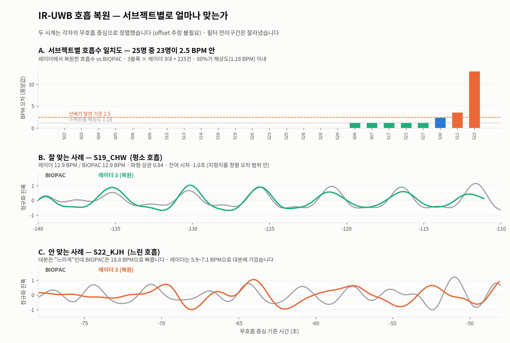

# 04. 기준선 — 학습 없는 고전 신호처리

모델이 무엇을 이겨야 하는지 정하기 위해, 학습을 전혀 쓰지 않는 신호처리 기준선을 먼저 세웠다.

> **왜 이것부터 하나.** 고전 방법을 세우지 않고 모델 성능만 보고하면
> "그거 FFT로도 되는 거 아니냐"는 질문에 답할 수 없다. 표준 절차다.

---

## 방법

1. 되먹임 필터로 정적 배경 제거 (β=0.98)
2. 가슴이 있는 거리 칸 탐지 (0.1~0.6 Hz 대역통과 후 분산 최대)
3. 그 칸의 I/Q 점 움직임에서 주성분 방향으로 투영 → 호흡 곡선
4. 대역통과 0.06~0.80 Hz
5. 스펙트럼 정점을 **포물선 보간**해 연속값으로 → 분당 횟수로 환산
6. 레이더 3대의 추정을 **중앙값**으로 융합

**포물선 보간이 왜 필요했나.** 처음에는 FFT 격자에서 최대 지점을 그대로 썼는데,
30초 창에서 격자 간격이 1.18 회/분이라 오차가 그 배수로만 나왔다.
"오차 0.00"이 실제로는 "해상도 안에서 구분되지 않음"이라는 뜻이었다.
정점 주변 3점을 로그 스펙트럼에서 포물선으로 맞춰 격자보다 미세한 값을 얻도록 고쳤다.

---

## 결과

30초 창, 지형지물 기준 28명 · 784창.

| 융합 방식 | MAE (회/분) | 1회/분 이내 |
|---|---|---|
| 레이더 1 단독 | 2.25 | 77% |
| 레이더 2 단독 | 1.99 | 73% |
| 레이더 3 단독 | 1.51 | 79% |
| **3대 중앙값 (기준선)** | **1.61** | **79%** |
| 3대 최선 (이론적 상한) | **0.32** | **95%** |

62초 창(구간 전체)으로 재면 MAE 1.08까지 내려간다. 창이 길수록 쉽다.

---

## 여기서 나온 결정적 관찰

### 1. 상한과의 격차가 크다

중앙값 융합 1.61 → 최선 선택 0.32. **5배 격차.**
정보는 이미 데이터 안에 있는데 고르지 못하고 있다는 뜻이다.

### 2. 가장 좋은 레이더는 고정되어 있지 않다

112건에서 최선이었던 레이더를 세면 **1번 38회 · 2번 36회 · 3번 38회**로 거의 균등.
"항상 3번을 쓴다" 같은 고정 규칙으로는 상한에 닿을 수 없다. **시점마다 판단해야 한다.**

### 3. 실패는 "못 봐서"가 아니라 "잘못 골라서"다

S22_KJH 예시 (실제 데이터):

| 구간 | BIOPAC 정답 | r1 | r2 | r3 | 중앙값이 고른 값 |
|---|---|---|---|---|---|
| 평소 호흡 | 19.3 | 4.1 | **19.3** | 8.3 | 8.3 ✗ |
| 회복 호흡 | 21.6 | **21.5** | 5.0 | 5.0 | 5.0 ✗ |
| 운동 후 | 29.4 | 6.9 | 30.9 | **29.2** | 29.2 ✓ |

매 구간마다 정답을 거의 정확히 맞힌 레이더가 있는데, 나머지 둘이 틀리는 바람에 중앙값이
엉뚱한 것을 집는다. **이 피험자의 오차 6.96은 센싱 실패가 아니라 선택 실패다.**

이 관찰이 [05_모델실험.md](05_모델실험.md)의 과제 정의(후보 선택)로 이어진다.

---

## 구간별

| 구간 | MAE (중앙값 융합) | MAE (최선 상한) | BIOPAC 평균 |
|---|---|---|---|
| 평소 호흡 | 0.81 | 0.11 | 14.4 회/분 |
| 느린 호흡 | 0.81 | 0.16 | 6.0 회/분 |
| 회복 호흡 | 1.72 | 0.44 | 14.9 회/분 |
| 운동 후 호흡 | 0.97 | 1.45 | 22.9 회/분 |

**운동 후 호흡만 상한 자체가 높다**(1.45). 다른 구간은 0.11~0.44인데.
후보 안에 정답이 잘 들어 있지 않다는 뜻으로, 체동이 큰 구간의 근본적 어려움이다.

---

## 복조 방식 비교

I/Q 평면의 점 궤적에서 호흡 곡선을 뽑는 방법 세 가지를 비교했다.

| 방식 | 설명 | MAE | 느린 호흡에서만 |
|---|---|---|---|
| 선형 투영 | 점들이 움직인 방향으로 자를 대고 사영 | **1.08** | 0.81 |
| 원 적합 + arctangent | 원 중심을 찾고 각도를 직접 읽음 | 2.69 | **0.10** |
| 타원 적합 + arctangent | I/Q 불균형까지 편 뒤 각도를 읽음 | 2.86 | **0.09** |

**전체로는 선형 투영이 이기지만, 느린 호흡에서는 arctangent가 8배 낫다.**
원·타원 적합이 체동에 취약해 운동 후 구간에서 무너지기 때문(0.97 → 5.29/6.63).

**그래서 후보를 늘리는 쪽을 택했다.** 레이더 3대 × 복조 3방식 = 9개 후보를 놓고
매번 최선을 고를 수 있다면 MAE 0.16 · 1회/분 이내 97%.
최선이었던 후보는 9개에 고르게 흩어진다(19·16·15·15·13·11·9·8·6회).

> **주의.** MoRe-Fi는 이 1차원 투영 방식 자체를 명시적으로 거부한다 —
> "타원 적합은 정지 상태 피험자용", "진폭이나 위상 어느 쪽 파형도 호흡을 제대로 표현하지 못한다".
> 우리 후보 9개는 전부 그 1차원 투영이다. [06_실패기록.md](06_실패기록.md) 참조.

생성 코드: [`figures/fig_base.py`](../../analysis/uwb-snn-2026-09-01/figures/fig_base.py) ·
[`figures/fig_match.py`](../../analysis/uwb-snn-2026-09-01/figures/fig_match.py)
