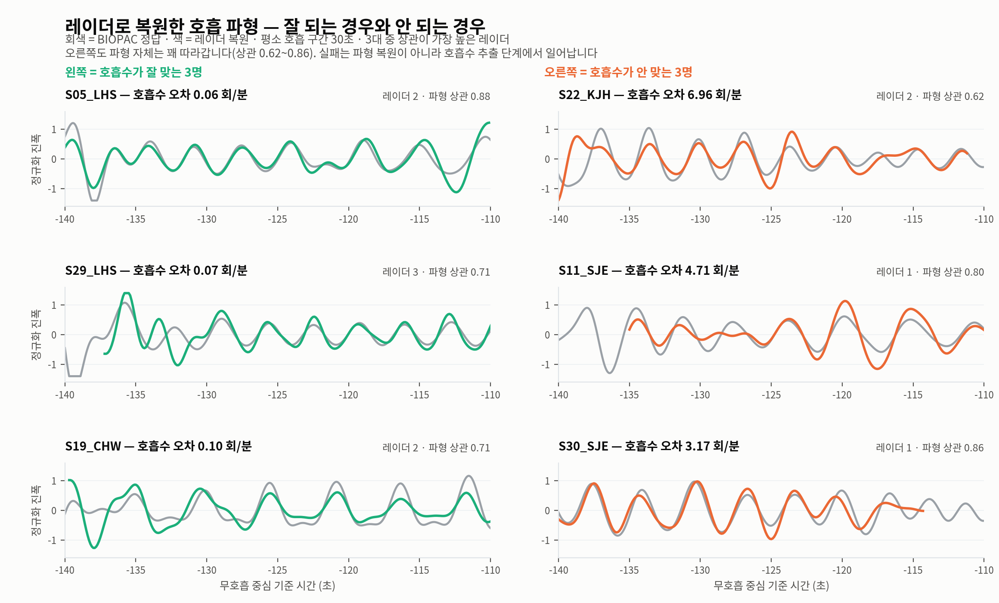

# 05. 모델 실험

## 과제 정의

**후보 선택.** 창마다 레이더 3대 × 복조 3방식 = **후보 9개**를 만들고, 각 후보의 호흡수 추정을
얼마나 믿을 수 있는지 모델이 점수로 매긴다. 점수가 가장 좋은 후보의 추정을 채택하고,
그 값과 BIOPAC 정답의 차이를 오차로 잰다.

**왜 이 과제인가.** 고전 신호처리로 이미 1.6 회/분이 나오는데, 매 순간 3대 중 옳은 것을 고를 수
있다면 0.32까지 내려간다. 그 격차가 학습이 파고들 자리다. 그리고 최선이었던 레이더가
1번 38회·2번 36회·3번 38회로 거의 균등해, 고정 규칙으로는 닿을 수 없다.

**한계.** end-to-end(신호에서 호흡수를 직접 읽기)는 별도로 시도했고 실패했다.
[06_실패기록.md](06_실패기록.md) 참조.

---

## 실험 설계

| | |
|---|---|
| 조건 1 — 자르는 기준 | 마커 기반 / 지형지물 기반 (2) |
| 조건 2 — 모델 | ANN / SNN × 인코딩 5종 (6) |
| 총 조합 | **12** |
| 분할 | 피험자 단위 학습/검증/평가 3분할, 4-fold |
| 에폭 | 상한 60, 검증셋 10에폭 정체 시 조기종료 |

두 조건 외 나머지는 전부 동일하게 고정 — 층 구조, 폭, 학습률, 배치, 손실, 시드.

---

## 결과 — 12조합 전체

| 자르기 | 모델 | 인코딩 | MAE (회/분) | 1회/분 이내 | 파라미터 | 조기종료 에폭 |
|---|---|---|---|---|---|---|
| 마커 | 고전 | — | 1.86 | 73% | 0 | — |
| 마커 | ANN | — | 1.77 | 79% | 17,377 | 2, 4, 2, 14 |
| 마커 | SNN | rate | 1.89 | 78% | 7,971 | 2, 13, 26, 35 |
| 마커 | SNN | step-forward | 1.91 | 79% | 7,971 | 4, 10, 9, 13 |
| 마커 | SNN | population | 1.96 | 79% | 8,259 | 2, 14, 2, 16 |
| 마커 | SNN | delta | 1.69 | 80% | 7,971 | 20, 10, 10, 19 |
| 마커 | SNN | direct | 1.58 | 80% | 7,875 | 10, 2, 40, 16 |
| 지형지물 | 고전 | — | 1.61 | 79% | 0 | — |
| 지형지물 | ANN | — | 1.53 | 86% | 17,377 | 13, 18, 9, 1 |
| 지형지물 | SNN | rate | 1.24 | 88% | 7,971 | 19, 29, 16, 54 |
| 지형지물 | SNN | step-forward | 1.23 | 89% | 7,971 | 14, 24, 36, 3 |
| 지형지물 | SNN | population | 1.31 | 87% | 8,259 | 9, 10, 5, 3 |
| **지형지물** | **SNN** | **delta** | **1.18** | **89%** | **7,971** | 18, 22, 34, 4 |
| 지형지물 | SNN | direct | 1.41 | 86% | 7,875 | 21, 32, 2, 1 |

원자료: [`metrics/train_v2.json`](metrics/train_v2.json)


*A — 14개 조합 전체 순위. B — 자르기를 바꾼 효과가 모델을 바꾼 효과보다 크다.
C — 검증셋이 좋아지기를 멈춘 에폭. 성적이 좋은 인코딩일수록 학습이 오래 이어진다.*
생성 코드: [`figures/fig_final.py`](../../analysis/uwb-snn-2026-09-01/figures/fig_final.py)

---

## 읽어야 할 것 세 가지

### 1. 자르는 방식이 모델보다 중요하다

지형지물로 자르면 어떤 방법을 써도 1.18~1.61. 마커로 자르면 1.58~1.96.
**자르기를 바꾼 효과(약 0.4)가 모델을 바꾼 효과(약 0.2)보다 크다.**

전처리·라벨 품질이 모델 선택보다 큰 영향을 준다는, 흔하지만 자주 무시되는 사실의 사례.

### 2. SNN이 ANN을 이긴다 — 파라미터는 절반 이하로

| | MAE | 파라미터 |
|---|---|---|
| ANN | 1.53 | 17,377 |
| SNN (delta) | **1.18** | **7,971** |

조기종료 에폭이 단서다. 지형지물 기준으로 **ANN은 평균 10.3에폭(1~18)에서 멈추는 반면
성적 상위 인코딩은 delta 평균 19.5, rate 평균 29.5까지 학습이 이어진다.**
ANN이 더 일찍 검증 성능 정체에 도달한다 — 즉 더 빨리 과적합한다.
데이터가 작을 때(피험자 28명) SNN의 스파이크 비선형성과 누설 적분이 정규화 역할을 하는
것으로 **해석**되지만, 이는 관찰에 대한 설명이지 별도로 검증한 사실은 아니다.

다만 population 인코딩은 평균 6.8에폭으로 ANN보다도 일찍 멈추면서 성능은 1.31로 ANN보다
좋다. **"오래 학습되면 좋다"는 단순 대응은 성립하지 않는다.**

> **주의.** 이는 방법론을 교정한 뒤의 결과다. 평가셋으로 에폭을 고르던 이전 코드에서는
> ANN 1.24 vs SNN 1.13으로 **거의 차이가 없었다.** 부풀려진 상태에서는 두 모델의 차이가
> 가려졌던 것. 이 교정이 결론을 바꿨다.

### 3. 인코딩 순위가 자르는 방식에 따라 뒤집힌다

| 인코딩 | 마커 기반 | 지형지물 기반 |
|---|---|---|
| rate | 1.89 | 1.24 |
| step-forward | 1.91 | 1.23 |
| population | 1.96 | 1.31 |
| delta | 1.69 | **1.18** |
| direct | **1.58** | 1.41 |

마커 기반에서는 direct가 최고, 지형지물에서는 delta가 최고. **순위가 뒤집힌다.**

앞선 분류 과제(각도·호흡상태)에서는 rate > step-forward > population > delta > direct 순서가
두 과제에서 동일했는데, 이 회귀성 과제에서는 그 순서가 유지되지 않는다.
**인코딩 선택은 과제와 데이터 품질에 따라 달라지며, 하나의 정답이 없다.**

다만 지형지물 기준으로 1.18~1.41 사이에 다 몰려 있어 차이가 크지는 않다.

---

## 모델 구조

동일한 골격에서 뉴런만 바꿨다.

```
SNN:  Linear(입력→96) → LIF → Linear(96→48) → LIF ┐
ANN:  Linear(100→96) → ReLU → Linear(96→48) → ReLU ┤
                                                    └→ concat(보조특징 13) → Linear(→48) → ReLU → Linear(→1)
```

| | |
|---|---|
| LIF 뉴런 | `snn.Leaky`, β 초기 0.9 (학습 가능), surrogate gradient = arctangent |
| 시간 전개 | 100 step (30초 @ 3.33 Hz) — SNN만 해당 |
| 입력 | 후보별 호흡 파형 1채널 × 100 step (인코딩에 따라 1·2·5배 확장) |
| 보조 특징 13종 | 배음비 h2·h3, 기본파 비중, 스펙트럼 엔트로피, 2등봉우리비, 전후 드리프트, 표준편차, 적합잔차, 레이더번호, 복조번호, 추정값, 중앙값과의 차, 합의수 |
| 출력 | 후보별 신뢰도 점수 1개 → 가장 낮은 점수의 후보 채택 |
| 손실 | MSE(log(1+오차)) + 0.5 × CrossEntropy(최선후보) — 회귀와 순위를 함께 |

**보조 특징에 대한 경고.** 절제 실험(이전 방법론 기준)에서 **이득의 대부분이 이 특징들에서
나왔다.** 파형만 주면 SNN은 기준선도 넘지 못했다(1.79 vs 1.66). 특징만 쓰고 SNN을 빼면 1.34,
둘 다 쓰면 1.18이었다. 즉 SNN 몫은 약 0.16.

교정된 방법론에서는 SNN이 ANN을 확실히 앞서지만, **파형 단독 기여가 작다는 사실 자체는
재검증이 필요하다.** [08_남은과제.md](08_남은과제.md) 참조.

---

## 잘 맞는 파형과 안 맞는 파형



위 3명은 오차 0.06~0.10 회/분, 아래 3명은 3.17~6.96 회/분. 그런데 **못 맞힌 경우에도
파형 자체는 따라간다**(상관 0.62~0.86). 무너지는 지점은 파형 복원이 아니라 **호흡수 추출**이다 —
체동이 섞여 스펙트럼에 봉우리가 두 개 생기면 엉뚱한 쪽을 고른다.

이는 [06_실패기록.md](06_실패기록.md)의 end-to-end 결과와 같은 방향을 가리킨다:
파형은 살아 있고, 문제는 그 파형에서 숫자 하나를 뽑는 마지막 단계다.
생성 코드: [`figures/fig_waves.py`](../../analysis/uwb-snn-2026-09-01/figures/fig_waves.py)

---

## 아직 근거가 없는 설정

| 설정 | 값 | 상태 |
|---|---|---|
| 은닉층 크기 | 96 → 48, 2층 | **탐색 안 함.** 데이터 규모 보고 임의로 정함 |
| 보조 특징 구성 | 13종 | **탐색 안 함.** 어느 것이 실제로 기여하는지 미확인 |
| 손실 가중 | 회귀 : 순위 = 1 : 0.5 | **탐색 안 함** |

이 셋은 검증셋 기준으로 탐색해야 제대로 된 설정이 된다.
나머지 설정의 근거는 [07_판단근거표.md](07_판단근거표.md).
