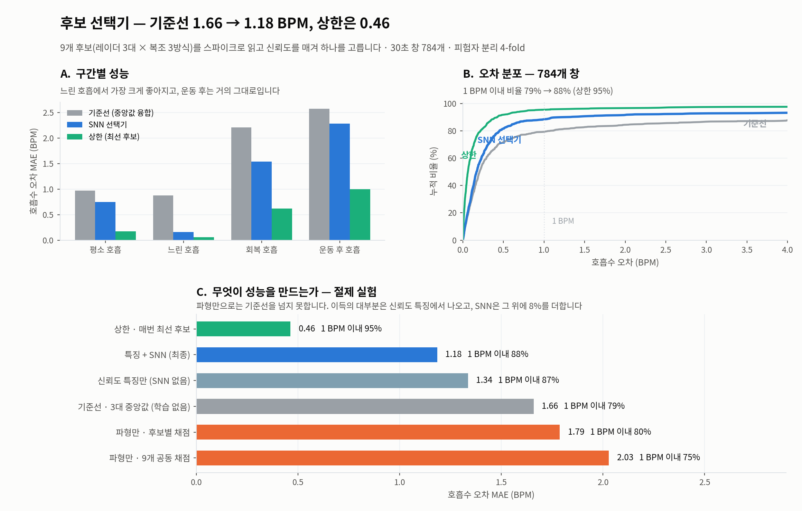

# 06. 실패 기록

안 된 것들과 그 원인. **성공한 것만 적으면 다음 사람이 같은 실패를 반복한다.**

---

## 1. 행동 7분류 SNN (81.5%) — 무효

**무엇.** 9명의 7시나리오 구간을 SNN으로 분류. 최고 81.5%.

**왜 무효인가.** 잘못된 I/Q 파싱 위에서 나온 수치. 위상이 망가진 상태라 크기만 쓰고 있었다.

**교훈.** 성능 숫자를 내기 전에 원시 데이터를 제대로 읽고 있는지부터 확인해야 한다.
이 오류는 "호흡 대역 봉우리가 46 bin 간격으로 두 개"라는 이상 신호로 드러났는데,
그 이상을 그냥 넘겼다면 끝까지 몰랐을 것이다.

---

## 2. 각도 분류 과제 — 방향 자체가 어긋남

**무엇.** |각도| 3분류 72.3%. 레이더 교차 일반화 74.9%, 45° 외삽까지 검증.

**왜 접었나.** 문헌 조사 결과 **각도 자체를 목표로 삼는 논문이 거의 없다.**
몸 방향은 *맞혀야 할 답*이 아니라 *극복해야 할 방해 변수*로 다뤄진다.

**교훈.** **모델을 만들기 전에 선행연구를 읽었어야 했다.** 물리 검증(0° 1.456 vs 90° 0.645,
p<1e-15, 28명 전원)까지 해놓고 방향이 어긋난 것을 나중에 알았다.

**남은 가치.** 버리지 않는다. 각도–진폭 관계는 **레이더 신뢰도 판단의 근거**로 쓸 수 있고,
회의에서도 "3대가 각도를 이용해 보정할 수 있는지 활용해도 좋다"는 조언이 있었다.

---

## 3. offset 추정 — 3전 3패

[03_동기화.md](03_동기화.md)에 상세. 요약하면 마커가 사람이 손으로 누른 것이라 불안정했다.
개수가 5~48개로 제각각.

**교훈.** 두 장비를 동시에 시작시키는 **공통 트리거**가 있었으면 이 문제 전체가 없었다.
다음 촬영에 반드시 요청해야 한다.

---

## 4. 환경 파일 배경 제거 — 데이터 없음, 대체법은 악화

**무엇.** 회의에서 "빈 방 1분 녹화로 배경을 빼라"는 조언. 그런데 전달된 30명 폴더에 없다.
유일한 예외인 S01_CMS의 24분 추가 녹화도 사람이 있는 파일럿 촬영이었다(bin 30에서 11.7회/분 호흡).

**대체법 시험.** SVD 지배성분 제거를 25명 전원에 적용.

| 처리 | MAE | 해상도 이내 |
|---|---|---|
| 없음 | 2.13 | 80% |
| SVD 1성분 제거 | 3.63 | 60% |
| SVD 2성분 제거 | 4.28 | 55% |

**오히려 나빠진다.** 앉아서 호흡하는 녹화에서는 지배 성분이 곧 사람의 가슴 반사다.

**해결.** MoRe-Fi의 되먹임 필터(β=0.98)로 대체. 기준선 1.66 → 1.55 개선.
다만 빈 방 녹화가 있으면 더 정확할 것이므로 요청 사항으로 남겼다.

---

## 5. arctangent 복조 — 부분 성공, 전체로는 손해

**무엇.** 원·타원을 적합해 위상을 직접 푸는 교과서적 방법.

| 방식 | 전체 MAE | 느린 호흡 | 운동 후 호흡 |
|---|---|---|---|
| 선형 투영 (현재) | **1.08** | 0.81 | **0.97** |
| 원적합 + arctangent | 2.69 | **0.10** | 5.29 |
| 타원보정 + arctangent | 2.86 | **0.09** | 6.63 |

**느린 호흡에서는 8배 좋아지지만 체동 구간에서 무너진다.** 원·타원 적합이 큰 움직임에 취약하다.

**활용.** 버리지 않고 **후보로 편입**했다. 어느 하나가 항상 옳은 게 아니라 상황마다 다르므로,
후보를 늘려두고 고르게 하는 쪽이 맞다. 9개 후보 중 최선을 고르면 MAE 0.16까지 내려간다.

---

## 6. end-to-end SNN — 완전 실패

**무엇.** 레이더 신호(가슴 주변 17칸 × I·Q × 3대 = 102채널)를 그대로 넣고 호흡수를 직접 출력.

| 조건 | 창 | MAE | 1회/분 이내 |
|---|---|---|---|
| 아무것도 학습 안 하고 평균만 답하기 | 784 | 5.87 | 11% |
| 호흡수 직접 예측 (rate 인코딩) | 784 | 5.26 | 15% |
| 호흡수 직접 예측 (direct) | 784 | 5.41 | 13% |
| **호흡수 직접 예측 (데이터 5배)** | **3,696** | **5.03** | **19%** |
| **파형 출력 (위상 둔감 손실)** | **3,696** | **6.42** | **41%** |
| 고전 신호처리 | 3,696 | **1.55** | **80%** |

**평균만 답하는 것보다 겨우 나은 수준이다. 사실상 학습이 안 됐다.**

**원인 세 가지.**

1. **데이터가 너무 적다.** 학습에 쓰는 창이 약 590개. MoRe-Fi는 8,000쌍(66시간).
   창을 5배로 늘려도 5.26 → 5.03으로 제자리 — **표본 수가 아니라 정보량 문제**임이 드러났다.
2. **정답이 창당 숫자 하나뿐이다.** 30초 신호(102채널 × 300스텝)를 넣고 정답은 "14.2" 하나.
   학습 신호가 590개밖에 없는 셈.
3. **호흡수는 본질적으로 주파수 측정이다.** FFT가 이를 최적으로, 학습 없이 푼다.
   신경망이 590개 예시로 푸리에 분석을 재발명하기를 기대한 것이 설계 실수였다.

**파형 출력이 시사하는 것.** 정답을 숫자 1개에서 100개로 늘리자 **1회/분 이내가 19% → 41%로
두 배**가 됐다. 평균 오차는 오히려 커졌지만(큰 실수가 남음), 정답 밀도가 학습을 좌우한다는
방향은 확인됐다. 파형 상관은 0.456 (논문 0.916).

**교훈.** 논문이 파형을 출력으로 잡은 것은 "호흡수가 파생값이라서"만이 아니라
**학습을 가능하게 만드는 장치**이기도 했다.

---

## 7. 후보 선택기의 SNN 기여도 — 특징이 대부분 (이전 방법론 기준)

**절제 실험.**

| 조건 | MAE | 1회/분 이내 |
|---|---|---|
| 파형만 · 9개 공동 채점 (SNN) | 2.03 | 75% |
| 파형만 · 후보별 채점 (SNN) | 1.79 | 80% |
| 기준선 · 3대 중앙값 (학습 없음) | 1.66 | 79% |
| 신뢰도 특징만 (SNN 없음, 5초 학습) | **1.34** | 87% |
| 특징 + SNN | **1.18** | 88% |

**레이더 파형만 주면 SNN은 기준선도 넘지 못한다.** 9개를 한꺼번에 보여 합의를 스스로 배우게
해도 더 나빠진다. 이득의 대부분이 손으로 만든 신뢰도 특징에서 나왔고, SNN 몫은 약 0.16.

**당시 인코딩 5종의 차이도 1.18~1.26으로 미미했다** — SNN 가지의 기여 자체가 작아서로 해석.

**단, 이 실험은 방법론 교정 전의 것이다.** 교정 후에는 SNN이 ANN을 확실히 앞서므로
(1.18 vs 1.53) **재검증이 필요하다.** [08_남은과제.md](08_남은과제.md) 참조.

---

## 8. 방법론 오류 — 평가셋으로 에폭 고르기

**무엇.** 매 에폭마다 **평가 폴드**에서 성능을 재고 그중 최고를 결과로 채택하고 있었다.
early stopping이 아니라 평가셋 선택이며, 결과가 부풀려진다.

**영향.**

| | 부풀려진 값 | 교정 후 |
|---|---|---|
| 마커 · ANN | 1.53 | 1.77 |
| 지형지물 · ANN | 1.24 | 1.53 |
| 지형지물 · SNN 최고 | 1.13 | 1.18 |

**최대 0.29 부풀려져 있었다.** 그리고 조건마다 부풀림 정도가 달라
**결론이 바뀌었다** — 이전에는 ANN과 SNN이 같아 보였는데, 교정 후에는 SNN이 확실히 앞선다.

**교정.** 피험자를 학습/검증/평가 3분할. 에폭은 검증셋으로만 고르고(상한 60, 인내 10),
평가셋은 마지막에 한 번만 본다.

**교훈.** 부풀림은 조건마다 균일하지 않다. "비교는 공정하니 괜찮다"고 넘기면 안 된다.

부풀려진 상태에서 만들었던 그림을 증거로 남겨둔다 — **이 그림의 숫자는 쓰면 안 된다.**

---

## 9. 마커 방식과의 비교를 불공정하게 함

**무엇.** "마커로 자른 것과 비교하라"는 요청에, 이미 팀과 함께 만들어둔
`HAI_동기화_종합.xlsx`를 쓰지 않고 즉석 규칙("3번째 마커가 실험2 시작")으로 비교했다.
마커 개수가 5~48개로 제각각이라 이 규칙은 성립하지 않는다.

**영향.** 마커 기반이 실제보다 나쁘게 나왔다 (2.25 → 실제 1.98, 짝지어 비교 시 1.78).

**교훈.** **이미 있는 산출물을 먼저 찾아 쓴다.** 다시 만들기 전에.
