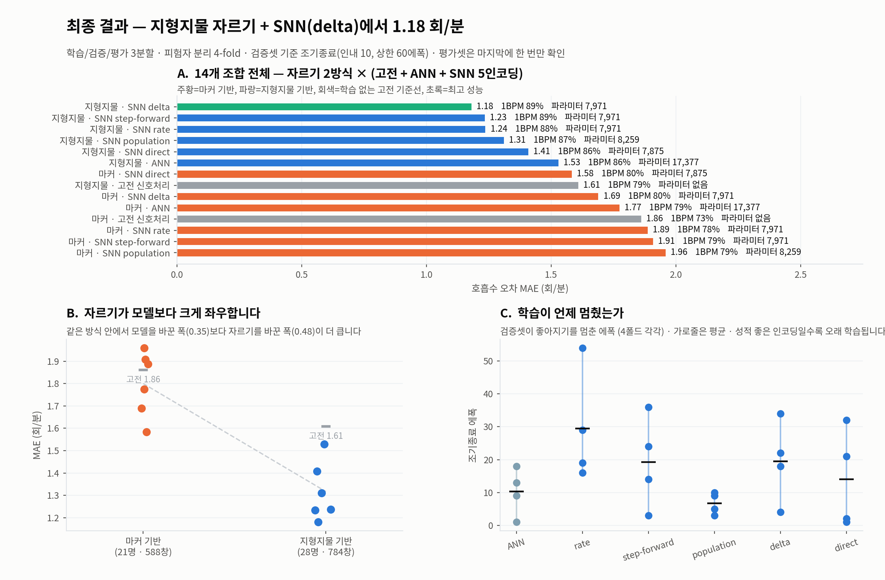

# UWB 레이더 호흡 추정 — 2026-09-01 작업 기록

이 폴더는 2026년 8월 31일 ~ 9월 1일 한 세션 동안 진행한 **모든 실험의 기록**입니다.
성공한 것뿐 아니라 **실패한 것과 그 원인**, 그리고 **매 단계에서 왜 그렇게 판단했는지**를 함께 남깁니다.

이덕원 · 2026-09-01 · $4
코드: [`analysis/uwb-snn-2026-09-01/`](../../analysis/uwb-snn-2026-09-01/)

---

## 어디부터 읽나

**실험 하나씩 보려면** → [`experiments/`](experiments/) — 16개 폴더, 각각 그 실험만의 보고서
**전체를 이어서 읽으려면** → [01_실험연대기.md](01_실험연대기.md)
**주제별로 보려면** → 아래 02~08

---

## 문서 순서

| 문서 | 내용 |
|---|---|
| [**experiments/**](experiments/) | **실험 16개, 각각 폴더 하나 + 보고서 하나.** 폴더 번호가 진행 순서 |
| [01_실험연대기.md](01_실험연대기.md) | 위 16개를 한 페이지로 이어 읽는 판 |
| [02_데이터와_전처리.md](02_데이터와_전처리.md) | 원시 데이터 구조, I/Q 파싱 오류와 수정, 배치 기하 |
| [03_동기화.md](03_동기화.md) | 마커 방식 / 지형지물 방식, 두 방식 전면 비교 |
| [04_기준선.md](04_기준선.md) | 학습 없는 고전 신호처리 기준선 |
| [05_모델실험.md](05_모델실험.md) | 12개 조합 (자르기 2 × 모델 6) 전체 결과 |
| [06_실패기록.md](06_실패기록.md) | 안 된 것들과 원인 규명 |
| [07_판단근거표.md](07_판단근거표.md) | 모든 설정값의 근거 — 표준인지 우리가 정한 건지 |
| [08_남은과제.md](08_남은과제.md) | 미해결 사항, 회의에서 확인할 것 |

---

## 최종 결과 한눈에

호흡수(회/분) 추정 오차. 30초 창, 피험자 분리 4-fold, 학습/검증/평가 3분할.

| 자르는 기준 | 방법 | MAE (회/분) | 1회/분 이내 |
|---|---|---|---|
| 마커 기반 | 고전 신호처리 (학습 없음) | 1.86 | 73% |
| 마커 기반 | ANN | 1.77 | 79% |
| 마커 기반 | SNN (최고: direct) | 1.58 | 80% |
| 지형지물 기반 | 고전 신호처리 (학습 없음) | 1.61 | 79% |
| 지형지물 기반 | ANN | 1.53 | 86% |
| **지형지물 기반** | **SNN (최고: delta)** | **1.18** | **89%** |

**세 가지가 드러났습니다.**

1. **자르는 방식이 모델보다 중요합니다.** 지형지물로 자르면 어떤 방법을 써도 1.18~1.61,
   마커로 자르면 1.58~1.89. 자르기를 바꾼 효과가 모델을 바꾼 효과보다 큽니다.
2. **SNN이 ANN을 이깁니다.** 1.18 vs 1.53. 파라미터는 SNN이 7,971개로 ANN 17,377개의 절반 이하입니다.
   조기종료 에폭을 보면 ANN은 평균 10.3에폭에서 멈추고 성적 상위 인코딩(delta 19.5, rate 29.5)은
   더 오래 학습됩니다 — ANN이 더 빨리 과적합합니다.
3. **레이더 신호에서 호흡을 직접 읽는 end-to-end는 실패했습니다.** 데이터 규모 때문입니다.
   자세한 내용과 근거는 [06_실패기록.md](06_실패기록.md).



---

## 데이터 규모

| | |
|---|---|
| 촬영 피험자 | 30명 (S01~S30) |
| 레이더 원본 존재 | 29명 (S24 없음) |
| 지형지물 기반 사용 가능 | **28명** (S01 제외 — 녹화 12.5초) |
| 마커 기반 사용 가능 | **21명** (7명은 경계 미검출) |
| 창 | 30초, 5초 이동 · 지형지물 784개 / 마커 588개 |
| 정답 | BIOPAC 호흡 벨트에서 계산한 호흡수 |

---

## 재현 방법

```bash
cd analysis/uwb-snn-2026-09-01
# 1) 전처리 캐시 생성 (원본 HAI_EXPERIMENT 필요)
python preprocess/ghost.py            # I/Q 파싱 검증
# 2) 동기화
python sync/sync12c.py                # 지형지물 정박 + 등급 판정
python sync/verify_marker.py          # 마커와 대조 검증
# 3) 데이터셋 (두 방식 각각)
python dataset/build_both.py
# 4) 학습 (12조합)
python models/train_v2.py
```

원본 데이터(`HAI_EXPERIMENT`)는 저장소에 포함하지 않습니다 — `.gitignore` 정책을 따릅니다.
