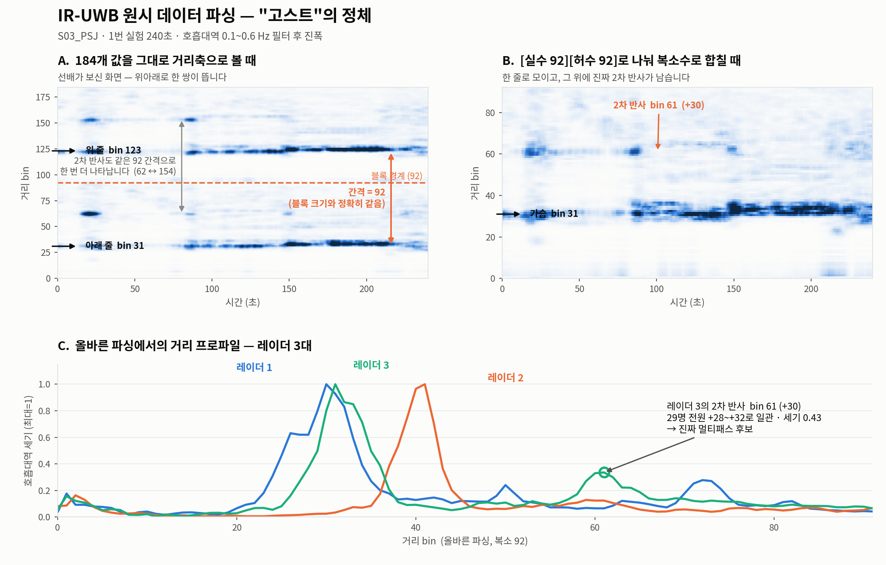

# 실험 3 · I/Q 파싱 오류 발견

## 한눈에

| | |
|---|---|
| **판정** | **⭐ 최대 발견** |
| 무엇이었나 | 185 float = [번호][실수 92][허수 92]. 인터리브가 아니었다 |
| 결과 | 전 데이터 재처리, 실험 1 폐기 |
| 규모 | 29명 전원 |
| 순서 | 3 / 16 · 이전 [과제재정의 각도](../02_과제재정의_각도/) |
| 다음 | [04 배치 기하](../04_배치기하/) |
| 보고서 | [회의자료_파싱과호흡복원.pdf](../../reports/회의자료_파싱과호흡복원.pdf) |

전체 목록: [experiments/README.md](../README.md)

---

## 왜 했나
각도 과제의 물리적 타당성을 확인하려고 레이더별 가슴 위치를 재던 중,
모든 레이더에서 호흡 대역 봉우리가 **정확히 46 bin 간격으로 두 개씩** 나타났다.
46은 전체 92 bin의 절반. 물리적 반사로는 나올 수 없는 규칙성이라 검증에 들어갔다.

## 무엇을 했나
실제 파일로 세 가지 파싱 가설을 비교했다.

| 파싱 방식 | 복소 복원 규칙 | 호흡대역 피크 | 판정 |
|---|---|---|---|
| A · 인터리브 (원본 코드) | `d(:,1:2:end) + 1i*d(:,2:2:end)` | bin 14~16 **그리고** 59~60 | 같은 표적이 46 bin 떨어져 중복 |
| **B · 전후분할 (채택)** | `d(:,1:92) + 1i*d(:,93:end)` | bin 28~32 — 봉우리 하나 | 물리적으로 타당 |
| C · 복소 아님 | 184개를 모두 실수 bin으로 | bin 28~32 **그리고** 123~127 | 앞·뒤 블록에 같은 표적 → 구조 증명 |

C가 결정적이다. 복소수로 안 묶고 184개를 그냥 실수로 늘어놓아도 같은 표적이 앞뒤 블록에
하나씩 나온다 — 즉 **파일 구조 자체가 앞 92 / 뒤 92 블록**이라는 뜻.

## 결과
한 프레임 185개 값은 `[프레임 카운터][실수 92][허수 92]` 구조.
원본 코드(`sync_tool_S02.m` 190번 줄)는 짝수·홀수 위치에서 번갈아 뽑아 복소수를 만들고 있었다.

## 검증 — BIOPAC과 대조
수정 후 레이더에서 뽑은 호흡 주파수가 BIOPAC과 일치.

| 피험자 | 레이더 | BIOPAC |
|---|---|---|
| S05 | 0.186 Hz | 0.176 Hz |
| S03 | 0.107 Hz | 0.117 Hz |
| S09 | 0.244 Hz | 0.244 Hz |

## 결정
전 피험자 재처리. [실험 1](../01_행동7분류_SNN/) 결과 폐기.

**주의:** 이는 신호처리 기법이 아니라 **파일을 올바르게 읽는 문제**였다.
논문들은 애초에 제대로 분리된 I/Q를 받는 데서 시작한다. 우리는 그 출발선에 서지 못했던 것.

## 관련
- 코드: [`preprocess/ghost.py`](../../../../analysis/uwb-snn-2026-09-01/preprocess/ghost.py) · [`preprocess/ghost2.py`](../../../../analysis/uwb-snn-2026-09-01/preprocess/ghost2.py) · [`preprocess/quad.py`](../../../../analysis/uwb-snn-2026-09-01/preprocess/quad.py)
- 원자료: [`ghost2.json`](../../metrics/ghost2.json)
- 그림: [I/Q 설명](../../assets/fig_iq.png) · 코드 [`figures/fig_ghost.py`](../../../../analysis/uwb-snn-2026-09-01/figures/fig_ghost.py)
- 문서: [02_데이터와_전처리.md](../../02_데이터와_전처리.md)
- 회의에 공유할 것: [08_남은과제.md](../../08_남은과제.md) — 선배 쪽 파형 복원도 같은 영향을 받을 수 있음
