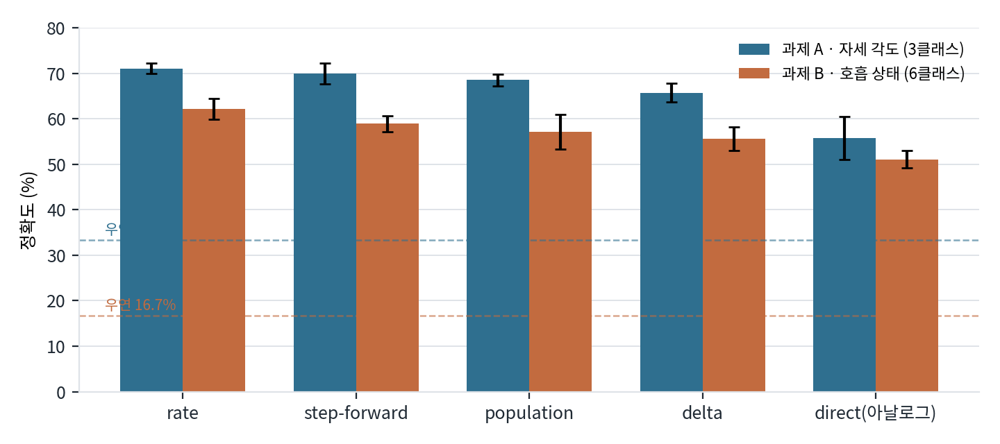

# 실험 7 · 과제 A(각도) · B(호흡상태) 학습

> **판정: 수치는 유효하지 않음.** 뒤에 발견된 평가셋 훔쳐보기([실험 16](../16_방법론교정/)) 이전 값이다.
> 다만 **인코딩 순위**라는 정성적 결론은 남는다.

## 왜 했나
스파이크 인코딩과 디코딩 방식이 성능에 얼마나 영향을 주는지, 두 과제에서 일관된지 확인.

## 무엇을 했나
스파이크 인코딩 5종 × 디코딩 3종을 두 과제에서 비교.

| 인코딩 | 방식 | 핵심 파라미터 |
|---|---|---|
| direct | 아날로그 값을 그대로 주입 (스파이크 아님) | — |
| rate | 베르누이 발화, 2채널 정류 | hi=2.0 |
| delta | ON/OFF 시간 대비 | th=0.3 |
| step-forward | 기준선 추적 | th=0.4 |
| population | 가우시안 수용야 M개 | M=5, lo/hi=∓2, th=0.55 |

## 결과 — 과제 A (|각도| 3분류, 28명, 우연 33.3%)

| 인코딩 | 정확도 | macro F1 |
|---|---|---|
| rate | 71.1 ± 1.2 | 0.723 |
| step-forward | 69.9 ± 2.3 | 0.717 |
| population | 68.5 ± 1.3 | 0.720 |
| delta | 65.7 ± 2.0 | 0.678 |
| direct (아날로그) | 55.8 ± 4.7 | 0.616 |

디코딩: 발화수 72.3% · 최초발화 71.6% · 막전위 71.1% — **거의 차이 없음.**

## 결과 — 과제 B (호흡상태 6분류, 25명, 우연 16.7%)
rate 62.1% 최고. **인코딩 순위가 과제 A와 완전히 동일.**

혼동행렬: [c_cmB.png](../../assets/c_cmB.png)

## 추가 검증 — 물리를 배웠나, 레이더를 외웠나
[실험 4](../04_배치기하/)에서 r1·r3이 등거리임을 확보해 둔 것을 활용했다.

| 학습 → 검증 | 거리 관계 | 정확도 |
|---|---|---|
| r1 → r3 | 등거리 | 74.9% |
| r1+r3 → r2 | 1.41배 멂 | 58.3% |

등거리끼리는 잘 옮겨가고 거리가 다르면 떨어진다 → **거리 정규화가 필요하다**는 뜻.

**45° 외삽:** 0°/90°만 학습하고 미학습 45°를 예측 → 중앙값 34.3°. 방향은 맞다.

## 이후
[실험 9](../09_문헌조사_방향전환/)에서 각도 과제 자체를 접었다.
순위 결론은 [실험 16](../16_방법론교정/)의 회귀 과제에서 **뒤집혔다** — 인코딩 선택에 정답이 없다는 근거.

## 관련
- 코드: [`models/train_A.py`](../../../../analysis/uwb-snn-2026-09-01/models/train_A.py) [`models/train_B.py`](../../../../analysis/uwb-snn-2026-09-01/models/train_B.py) [`models/enc2.py`](../../../../analysis/uwb-snn-2026-09-01/models/enc2.py) [`models/cross_radar.py`](../../../../analysis/uwb-snn-2026-09-01/models/cross_radar.py)
- 원자료: [`summary_A.json`](../../metrics/summary_A.json) [`summary_B.json`](../../metrics/summary_B.json) [`cross_radar.json`](../../metrics/cross_radar.json) [`extrap.json`](../../metrics/extrap.json)
