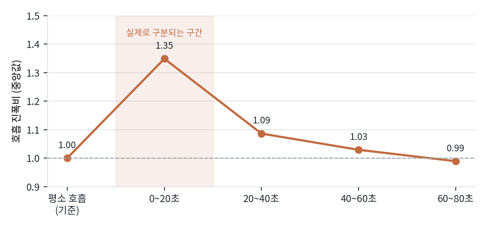

# 실험 8 · 회복 호흡 라벨 정정

> **판정: 초판 서술 철회.** 사용자 지적이 맞았고, 원인은 생리가 아니라 라벨 구간 설정이었다.

## 왜 했나
사용자 지적: "평소 호흡과 회복 호흡이 신호상 같다"는 서술이 생리적으로 이상하다.
숨을 참았다 회복하려면 더 많은 호흡이 필요하지 않은가.

타당한 지적이라 **데이터로 다시 확인**했다.

## 무엇을 했나
BIOPAC으로 무호흡 종료를 0초로 맞춰 25명의 호흡 진폭·호흡률을 20초 구간별로 재측정.

## 결과

| 구간 | 진폭비 (중앙값) | 호흡률 차이 | 진폭 15% 이상 증가 |
|---|---|---|---|
| 평소 호흡 (기준) | 1.00 | — | — |
| 무호흡 후 0~20초 | **1.35** | +0.0 /분 | 17 / 25명 |
| 20~40초 | 1.09 | +1.0 /분 | 10 / 25명 |
| 40~60초 | 1.03 | +2.0 /분 | 7 / 25명 |
| 60~80초 | 0.99 | +3.0 /분 | 9 / 25명 |

## 해석
회복 반응은 **실재한다.** 다만 **빨라지는 게 아니라 깊어진다** —
호흡률은 거의 그대로인데 진폭이 1.35배. 그리고 **20~40초면 평소 수준으로 돌아온다.**

## 진짜 원인
혼동의 원인은 생리가 아니라 **라벨 구간을 62초로 잡은 것**이었다.
실제로 구분되는 구간은 앞의 20초뿐이라, **라벨의 3분의 2가 이미 평소 호흡으로 돌아온 신호**였다.

## 결정
회복 호흡 라벨을 18~46초로 좁힌 데이터셋([`dataset/build_B2.py`](../../../../analysis/uwb-snn-2026-09-01/dataset/build_B2.py))을 준비.
다만 **학습은 아직 돌리지 않았다** — [08_남은과제.md](../../08_남은과제.md).

## 교훈
"신호상 구분이 안 된다"는 결과를 받았을 때 모델이나 신호를 의심하기 전에
**라벨 정의가 그 현상을 담고 있는지**를 먼저 봐야 한다.

## 관련
- 코드: [`analysis/recov.py`](../../../../analysis/uwb-snn-2026-09-01/analysis/recov.py)
- 원자료: [`recovery.json`](../../metrics/recovery.json)
