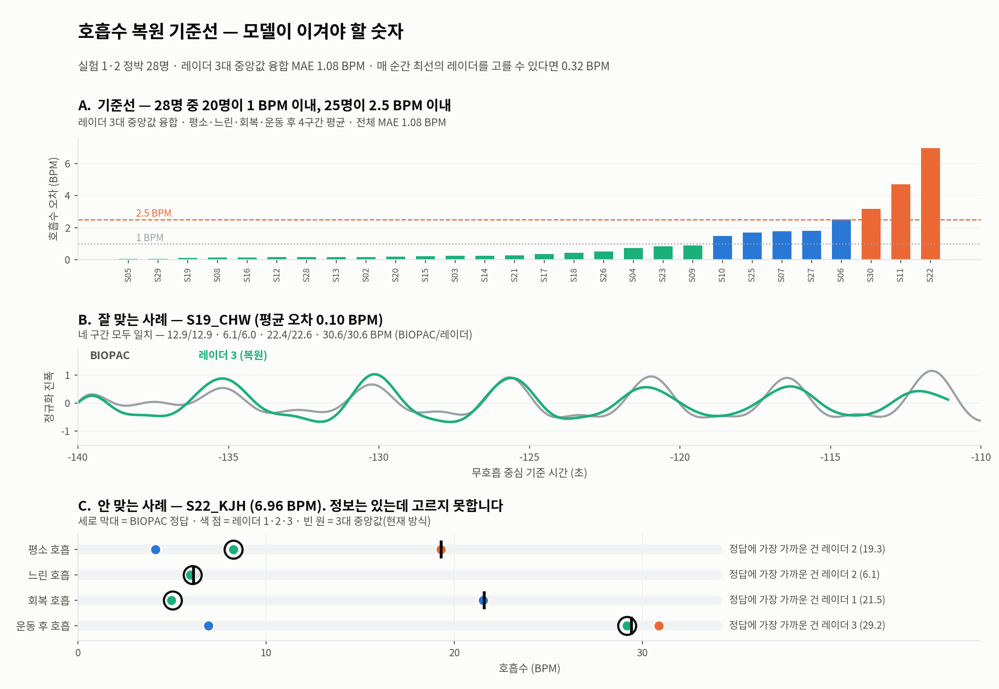

# 실험 11 · 고전 신호처리 기준선 확정

## 한눈에

| | |
|---|---|
| **판정** | **✅ 확정** |
| 무엇이었나 | 1.61 회/분. 매번 최선을 고르면 0.32 — 그 격차가 학습할 자리 |
| 결과 | MAE 1.61 · 1회/분 79% |
| 규모 | 28명 · 784창 |
| 순서 | 11 / 16 · 이전 [회의피드백 검증](../10_회의피드백_검증/) |
| 다음 | [12 후보 선택기](../12_후보선택기/) |
| 보고서 | [회의자료_파싱과호흡복원.pdf](../../reports/회의자료_파싱과호흡복원.pdf) |

전체 목록: [experiments/README.md](../README.md)

---

## 왜 했나
모델이 무엇을 이겨야 하는지 정해야 한다.
**학습 없는 고전 신호처리부터** 세워두지 않으면, 나중에 나온 숫자가 좋은 건지 알 수 없다.

## 처리 순서

| 단계 | 방법 | 왜 이렇게 |
|---|---|---|
| 1. 배경 제거 | 되먹임 필터 `c_n = β·c_{n−1} + (1−β)·r_n`, 출력 `r_n − c_n`, **β=0.98** | 논문 값 0.9는 10 Hz에서 차단 0.16 Hz — 호흡 대역을 잘라먹는다. 0.98이면 0.032 Hz |
| 2. 가슴 bin 탐지 | 창 안에서 호흡 대역 에너지 최대 bin | 피험자가 움직이므로 고정 bin은 성립하지 않음 |
| 3. 복조 | I/Q 주성분 선형 투영 | 아래 비교 참조 |
| 4. 대역통과 | 0.08~0.6 Hz | 4.8~36 회/분 |
| 5. 주파수 추정 | 스펙트럼 정점 + **포물선 보간** | 30초 창의 FFT 격자는 2 회/분 — 보간 없이는 양자화 오차가 결과를 지배 |
| 6. 융합 | 레이더 3대 중앙값 | 한 대가 틀려도 버팀 |

## 복조 방식 비교

| 방식 | 전체 MAE | 느린 호흡 | 운동 후 호흡 |
|---|---|---|---|
| 선형 투영 (채택) | **1.08** | 0.81 | **0.97** |
| 원적합 + arctangent | 2.69 | **0.10** | 5.29 |
| 타원보정 + arctangent | 2.86 | **0.09** | 6.63 |

arctangent 계열은 **느린 호흡에서 8배 좋아지지만 체동 구간에서 무너진다** —
원·타원 적합이 큰 움직임에 취약하기 때문. 어느 하나가 항상 옳지 않다.
→ 버리지 않고 [실험 12](../12_후보선택기/)의 **후보로 편입**했다.

## 최종 기준선 (30초 창)

| 자르는 기준 | MAE | 1회/분 이내 |
|---|---|---|
| 지형지물 | **1.61** | 79% |
| 마커 | 1.86 | 73% |

## 가장 중요한 관찰
매 순간 **3대 중 옳은 것을 고를 수 있다면 0.32~0.46까지** 내려간다.
그리고 최선이었던 레이더가 **1번 38회 · 2번 36회 · 3번 38회로 거의 균등** —
고정 규칙("항상 r2를 써라")으로는 닿을 수 없고, 시점마다 판단해야 한다.

**그 격차가 학습이 파고들 자리다.**

## 결정
모델의 임무를 "호흡을 읽는 것"이 아니라 **"어느 추정을 믿을지 고르는 것"**으로 정의.
→ [실험 12](../12_후보선택기/)

## 관련
- 코드: [`analysis/baseline.py`](../../../../analysis/uwb-snn-2026-09-01/analysis/baseline.py) [`analysis/arctan.py`](../../../../analysis/uwb-snn-2026-09-01/analysis/arctan.py) [`analysis/match.py`](../../../../analysis/uwb-snn-2026-09-01/analysis/match.py)
- 원자료: [`baseline3.json`](../../metrics/baseline3.json) [`per_subject.json`](../../metrics/per_subject.json) [`match.json`](../../metrics/match.json)
- 그림: [피험자별 일치도](../../assets/fig_match.png)
- 문서: [04_기준선.md](../../04_기준선.md)
