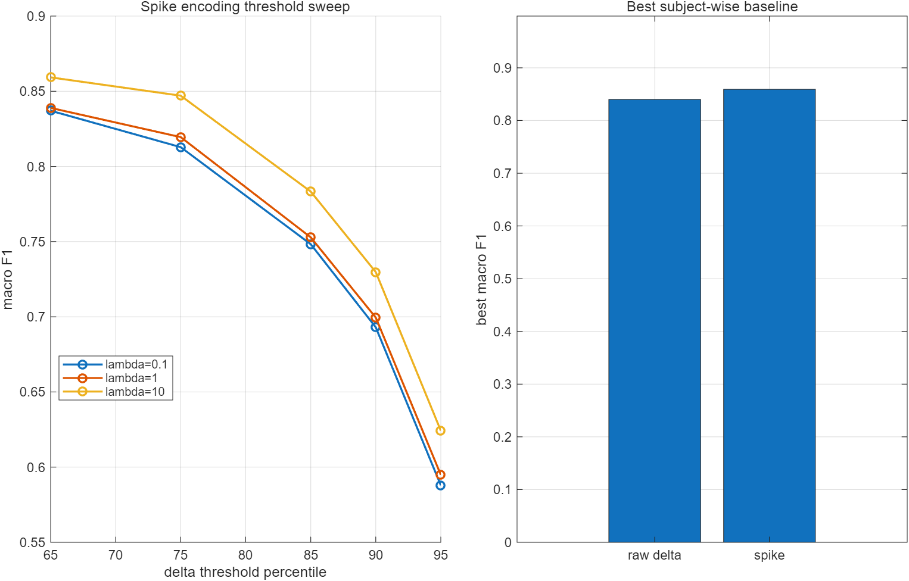
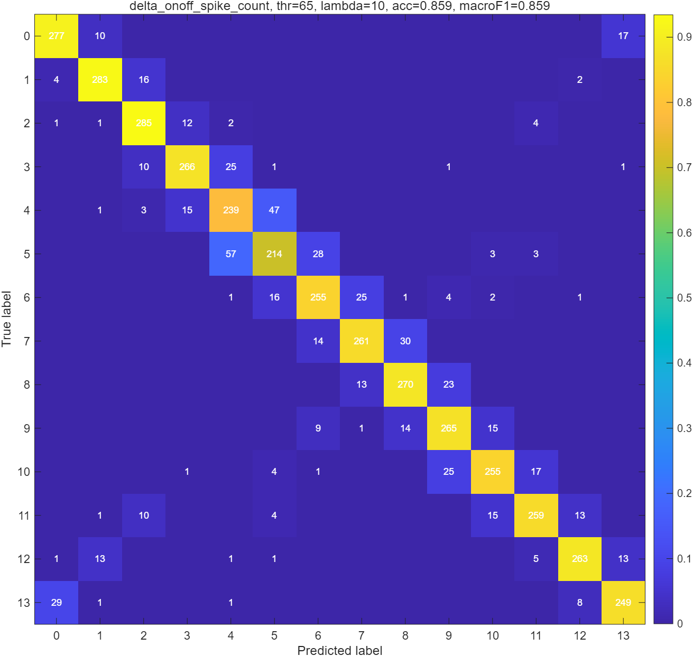
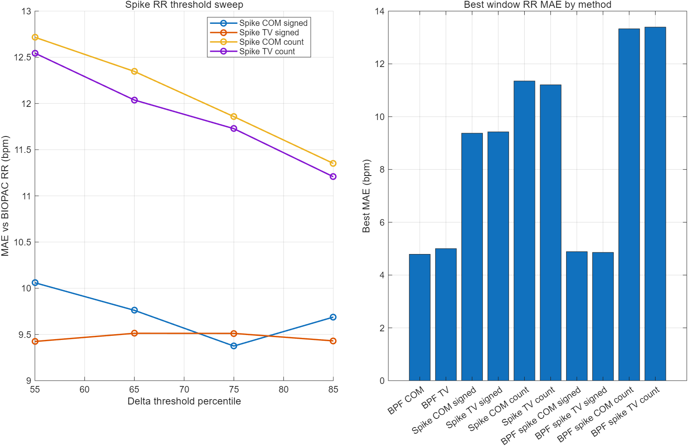
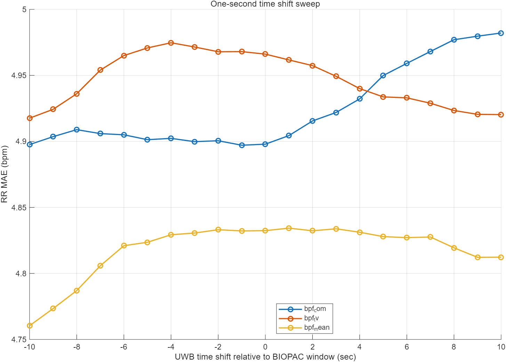
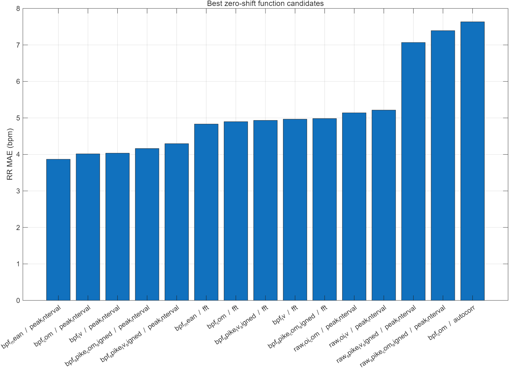

# UWB Spike / BIOPAC Analysis Report

이 문서는 UWB 데이터와 BIOPAC 기준 신호를 비교해서, spike encoding과 RR tracking이 어느 정도 가능한지 팀원이 빠르게 이해할 수 있도록 정리한 요약입니다.

원본 `.mat` 데이터, subject별 상세 window CSV, 학습된 모델 weight는 포함하지 않았습니다. 이 폴더에는 재현용 코드와 aggregate 그래프만 있습니다.

전체 aggregate 평가표는 [metrics](metrics/README.md)에 따로 모아두었습니다.

## 한 줄 요약

UWB 신호를 spike feature로 변환하면 label 분류는 가능했고, RR 추정도 BIOPAC과 어느 정도 맞출 수 있었습니다. 다만 "시간에 따른 변화 추적"은 아직 약해서, 다음 단계는 ROI 안정화와 움직임 rejection입니다.

## 데이터와 목표

- 입력 데이터: UWB `com_final`, `tv_final`, `bpf_com`, `bpf_tv`
- 기준 데이터: BIOPAC `bpf_bio_final`
- 주요 목표:
  - UWB를 spike encoding해서 14개 label을 분류할 수 있는지 확인
  - BIOPAC RR을 기준으로 UWB RR 추정 성능 비교
  - 30초 window를 움직이며 time shift / tracking이 되는지 확인
  - SNN 라이브러리(`snntorch`)로 간단한 모델을 구성해 학습 가능성 확인

## 1. Spike Encoding Label Classification

UWB `com_final`, `tv_final`을 subject 단위 robust z-score로 정규화한 뒤, frame 차분값에서 ON/OFF spike를 만들었습니다.

- ON spike: `dx > threshold`
- OFF spike: `dx < -threshold`
- threshold: subject별 차분 크기의 percentile
- feature: COM ON/OFF + TV ON/OFF spike rate
- split: subject-wise cross validation

Best baseline:

| Feature | Threshold | Model | Accuracy | Macro F1 |
|---|---:|---|---:|---:|
| Delta ON/OFF spike count | 65 percentile | Ridge | 0.859 | 0.859 |
| Raw delta magnitude | - | Ridge | 0.840 | 0.840 |

해석:

- spike feature가 raw delta feature보다 약간 더 좋았습니다.
- 즉 "spike encoding이 의미 있는 특징을 잡는다"는 1차 근거는 있습니다.

## 2. BIOPAC 기준 RR 비교

30초 window, 15초 stride로 BIOPAC RR을 정답처럼 두고 UWB RR을 비교했습니다.

핵심 결과:

| Method | MAE |
|---|---:|
| BPF COM | 4.79 bpm |
| BPF TV | 5.00 bpm |
| BPF spike TV signed | 4.86 bpm |
| Raw range-bin spike best | 9.37 bpm |

해석:

- raw range-bin spike만으로 바로 RR을 뽑으면 움직임 영향이 큽니다.
- 이미 필터링된 BPF 신호에 signed spike encoding을 적용하면 기존 BPF baseline에 가까운 성능이 나옵니다.

## 3. Shift / Tracking Evaluation

교수님이 말한 "하나씩 shift하면서 추적이 되는지 보라"는 방향으로, 30초 window를 1초 stride로 움직이며 더 촘촘하게 평가했습니다.

- window: 30초
- stride: 1초
- time shift: -10초부터 +10초까지 1초 단위
- tracking windows: 11,382개
- 사용 파일: 44개
- 제외/오류 파일: 2개

Time shift 결과:

| Method | Best shift | Best MAE | Zero-shift MAE | Improvement |
|---|---:|---:|---:|---:|
| BPF COM | -1 sec | 4.90 bpm | 4.90 bpm | -0.00 bpm |
| BPF TV | -10 sec | 4.92 bpm | 4.97 bpm | -0.05 bpm |
| BPF mean | -10 sec | 4.76 bpm | 4.83 bpm | -0.07 bpm |

해석:

- 단순 time shift 보정은 효과가 매우 작았습니다.
- 따라서 현재 병목은 시간 동기화보다는 UWB 신호 품질, ROI 선택, 움직임 영향 쪽으로 보입니다.

## 4. RR 추정 함수 비교

FFT만 쓰지 않고 여러 RR 추정 함수를 비교했습니다.

- FFT dominant frequency
- autocorrelation peak
- peak interval
- BPF signal
- BPF signed spike
- raw ROI signal
- raw ROI signed spike

Top candidates:

| Rank | Method | Estimator | MAE | RMSE | Trend Accuracy |
|---:|---|---|---:|---:|---:|
| 1 | BPF mean | peak interval | 3.87 | 4.79 | 0.295 |
| 2 | BPF COM | peak interval | 4.02 | 4.97 | 0.220 |
| 3 | BPF TV | peak interval | 4.03 | 4.98 | 0.229 |
| 4 | BPF spike COM signed | peak interval | 4.16 | 5.08 | 0.270 |
| 5 | BPF spike TV signed | peak interval | 4.30 | 5.23 | 0.277 |
| 6 | BPF mean | FFT | 4.83 | 5.96 | 0.145 |

해석:

- FFT보다 peak interval 방식이 MAE를 크게 낮췄습니다.
- 하지만 trend accuracy는 아직 낮습니다.
- 즉 RR 값 자체는 어느 정도 맞지만, BIOPAC이 올라갈 때 UWB도 같이 올라가는 "변화 추적성"은 아직 부족합니다.

## 5. SNN Holdout Test

`snntorch`로 간단한 SNN을 만들고, subject 1/2를 test로 완전히 제외한 뒤 나머지 subject로 학습했습니다.

| Model | Input | Test Accuracy | Test Macro F1 |
|---|---|---:|---:|
| SNN | spike-rate + rate encoding | 0.755 | 0.749 |
| Ridge baseline | raw delta | 0.827 | 0.825 |
| Ridge baseline | spike feature | 0.816 | 0.815 |

해석:

- SNN은 동작하고 spike input으로 학습됩니다.
- 다만 현재 첫 모델은 ridge baseline보다 낮습니다.
- train 성능은 높고 test가 흔들려서 과적합이 있습니다.

## 결론

현재까지의 결론은 다음과 같습니다.

1. UWB spike encoding은 label 분류에서 의미 있는 성능을 냅니다.
2. RR 추정은 BPF 기반 peak interval 방식이 가장 좋았습니다.
3. 단순 time shift 보정은 효과가 작습니다.
4. 시간 변화 추적성은 아직 약합니다.
5. 다음 개선 방향은 ROI 안정화, 움직임 rejection, subject holdout 반복 평가입니다.

교수님께 짧게 말하면:

> 30초 window를 1초 stride로 움직이며 UWB/BIOPAC RR tracking을 평가했습니다. 단순 time shift 보정은 성능 개선이 거의 없었고, RR 추정 함수 선택이 더 큰 영향을 보였습니다. FFT보다 peak-interval 기반 추정이 MAE를 3.87 bpm까지 낮췄지만, correlation과 trend accuracy가 낮아 시간적 변화 추적성은 아직 부족합니다. 다음 단계는 ROI 안정화와 움직임 rejection입니다.
